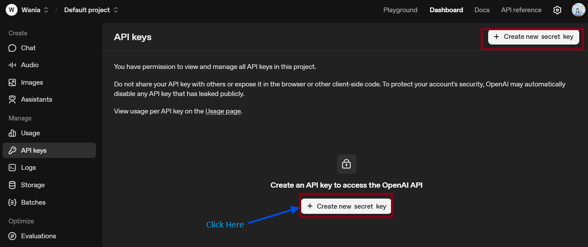
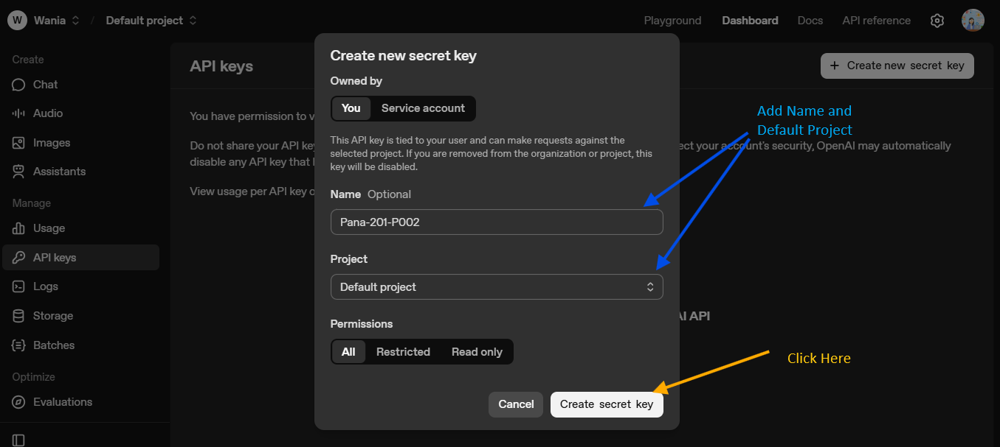
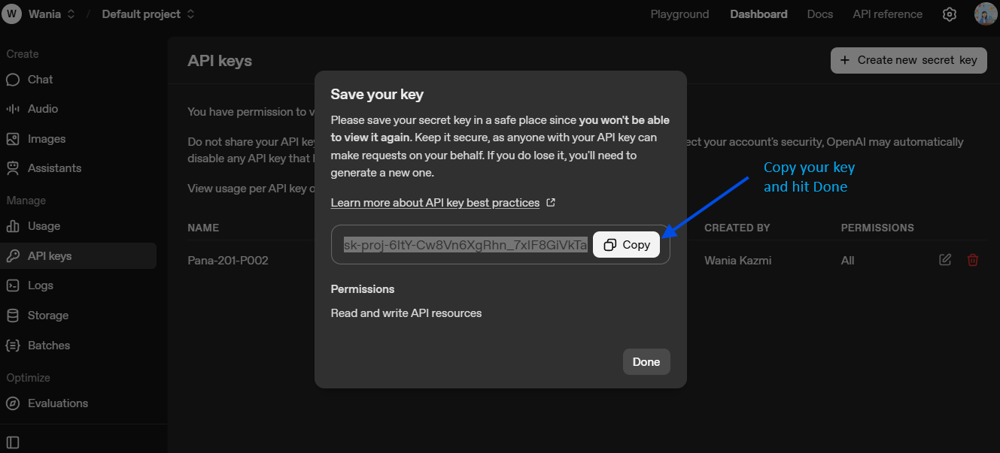
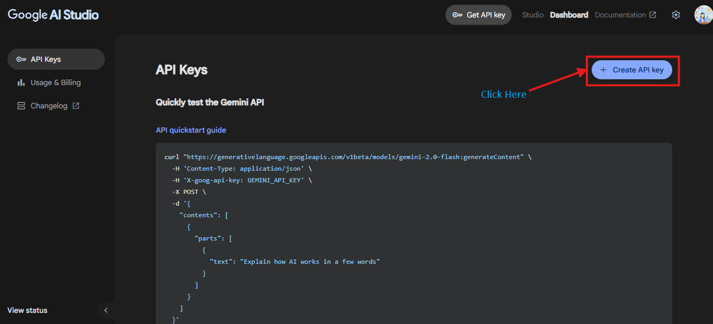
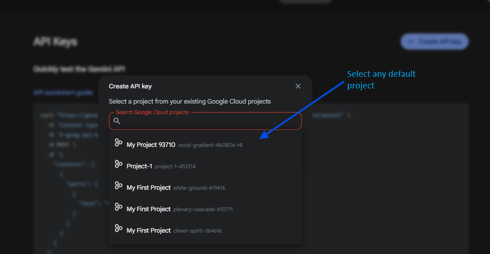
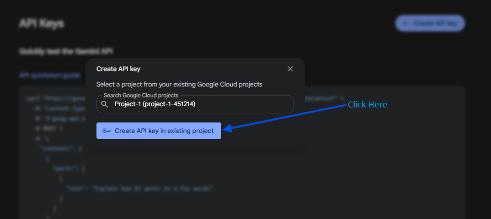
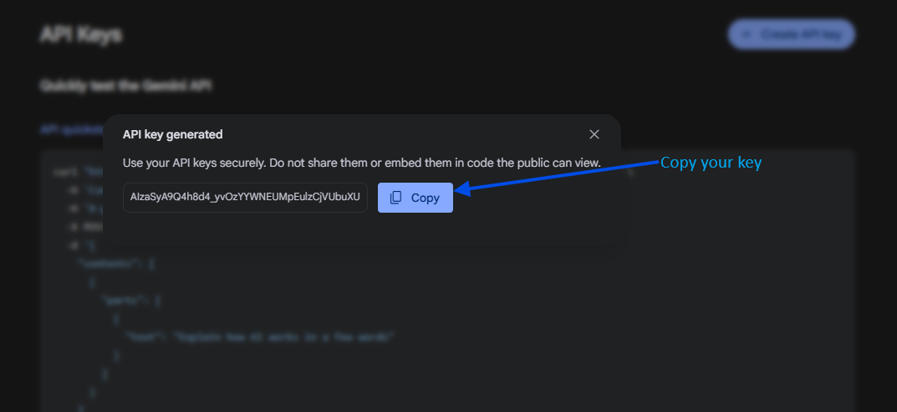

# How to Get OpenAI API Key and Gemini API Key

If you want to use AI services from OpenAI or Google Gemini in your projects, you’ll need to obtain API keys from both providers. Here’s a step-by-step guide for each.

---

## 1. Getting an OpenAI API Key

**OpenAI provides access to models like GPT-4 and GPT-4o-mini via API.**

### Steps:

1. **Sign Up or Log In:**

   * Go to [OpenAI Platform](https://platform.openai.com/).
   * Sign up for a free account, or log in if you already have one.

2. **Navigate to API Keys:**

   * After logging in, go to setting button.
   * Select “API keys” or go directly to [https://platform.openai.com/api-keys](https://platform.openai.com/api-keys).
    
3. **Create a New API Key:**

   * Click the **+ Create new secret key** button.
   * Give your key a name if prompted (for your reference).
   
   * Copy the generated key and **store it somewhere safe**! You won’t be able to view it again.
   

**Note:**

* You may need to enter payment details for higher usage limits.
* Keep your API key private and do not expose it in public repositories.

---

## 2. Getting a Gemini API Key (Google Generative AI)

**Google Gemini (previously called Bard, or Generative Language API) is Google’s family of LLMs.**

### Steps:

1. **Go to Google AI Studio:**

   * Visit [Google AI Studio](https://aistudio.google.com/app/apikey).

2. **Sign In with Google:**

   * Sign in using your Google account.

3. **Create a Gemini API Key:**

   * On the API keys page, click **“Create API key”**.
   
   * Select default project.
   
   * Hit button to generate API key
   
   * Copy your key—**you’ll need this for your applications**.
   

4. **Enable Billing (if prompted):**

   * For higher quotas or production use, you may need to enable billing. Follow the instructions in Google Cloud Console.

**Note:**

* Your Gemini API key should also be kept private.
* Refer to Google’s official [documentation](https://ai.google.dev/gemini-api/docs/quickstart) for more details.

---

## Security Reminder

* **Never share your API keys publicly.**
* Use environment variables or secret managers to handle keys securely.

---

## Quick Reference Table

| Provider      | Website                                                                          | API Key Link                                                                     |
| ------------- | -------------------------------------------------------------------------------- | -------------------------------------------------------------------------------- |
| OpenAI        | [https://platform.openai.com/](https://platform.openai.com/)                     | [https://platform.openai.com/api-keys](https://platform.openai.com/api-keys)     |
| Google Gemini | [https://aistudio.google.com/app/apikey](https://aistudio.google.com/app/apikey) | [https://aistudio.google.com/app/apikey](https://aistudio.google.com/app/apikey) |

---

If you face any issues, refer to the [OpenAI documentation](https://platform.openai.com/docs/) or [Google Gemini docs](https://ai.google.dev/gemini-api/docs/quickstart).

---