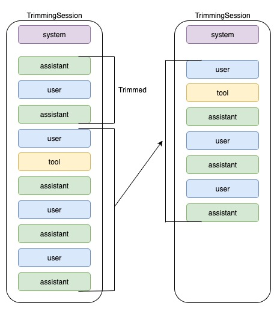

# Sub-Lesson 01: Context Trimming

## 📖 Overview

Learn how to implement **context trimming** - keeping only the last N turns and dropping older context. This is the simplest and most common context management pattern.

## 🎯 The Problem

As conversations grow longer:

- Context window fills up with old, irrelevant messages
- Costs increase (more tokens per request)
- Latency increases (longer prompts to process)
- Models may lose focus on recent context

## 💡 The Solution

**Context Trimming**: Keep only the last N "turns" of conversation.



- A **turn** = one user message + all responses (assistant, tool calls, tool results) until the next user message
- When turn count > `max_turns`, drop the oldest turns
- Keep turn boundaries intact (don't split mid-turn)

## ✅ When to Use Context Trimming

**Best for**:

- Short workflows (< 30 minutes)
- Tool-heavy operations (support agents, data analysis)
- Tasks where recent context matters more than distant context
- Need for deterministic, predictable behavior

**Avoid when**:

- Need to remember distant context (long research, multi-day projects)
- Tasks with dependencies across many turns
- Need to reference early conversation details

## 📊 Pros & Cons

| Pros                                         | Cons                              |
| -------------------------------------------- | --------------------------------- |
| ✅ Zero latency overhead                     | ❌ Hard cut-off loses old context |
| ✅ Deterministic (no summarization variance) | ❌ Can "forget" important details |
| ✅ Simple to implement and debug             | ❌ No long-range memory           |
| ✅ Predictable token usage                   | ❌ May repeat resolved issues     |

## 🏗️ How It Works

### Step 1: Define a Turn

```
Turn 1:
  - user: "My laptop won't start"
  - assistant: "Let's troubleshoot..."
  - tool_call: check_power_status()
  - tool_result: "Power cable connected"
  - assistant: "Try holding power button..."

Turn 2:
  - user: "Still not working"
  - assistant: "Let's check the battery..."
  ...
```

### Step 2: Count User Messages

- Walk through history
- Count messages where `role == "user"` and NOT synthetic
- Synthetic messages (summaries) don't count as real turns

### Step 3: Trim to Last N

- If user turns > `max_turns`, find the earliest of the last N user messages
- Keep everything from that point forward
- Drop everything before


## What counts as a “turn”

A turn = one user message plus everything that follows it (assistant replies, reasoning, tool calls, tool results) until the next user message.

When trimming happens
- On write: add_items(...) appends the new items, then immediately trims the stored history.
- On read: get_items(...) returns a trimmed view (so even if you bypassed a write, reads won’t leak old turns).

### How it decides what to keep?
- Treat any item with role == "user" as a user message (via _is_user_msg).
- Scan the history backwards and collect the indices of the last N user messages (max_turns).
- Find the earliest index among those N user messages.
- Keep everything from that index to the end; drop everything before it.

That preserves each complete turn boundary: if the earliest kept user message is at index k, you also keep all assistant/tool items that came after k.


## 🚀 Getting Started

### 1. Set up environment

```bash
# Copy environment template
cp .env_backup .env

# Edit .env and add your API key
# GEMINI_API_KEY=your_key_here
```

## 🔧 Key Parameter: `max_turns`

### How to Choose

1. **Estimate average turn complexity**:

   - Simple Q&A: 1 turn = ~200 tokens
   - Tool-heavy: 1 turn = ~1,500 tokens (user + tool calls + results)
   - Complex reasoning: 1 turn = ~3,000 tokens

2. **Calculate token budget**:

   - Target: Use 40-60% of context window
   - For Gemini 2.0 Flash (272k context): Target ~100k tokens
   - Example: 100k / 1,500 tokens per turn = ~66 turns max

3. **Start conservatively**:
   - Begin with `max_turns=5-8` for most use cases
   - Monitor: Are agents "forgetting" recent context? Increase
   - Monitor: Are costs too high? Decrease

## 📊 Evaluation Metrics

Track these to measure effectiveness:

### Efficiency Metrics

- **Tokens per turn**: Should stabilize after trimming starts
- **Context window utilization**: Target 40-60%
- **Cost per conversation**: Lower with trimming

### Quality Metrics

- **Recent recall**: Can agent remember last 3-5 turns?
- **Coherence**: Do responses align with recent context?
- **Task completion**: Does agent still solve problems?

## 🎯 Real-World Scenario

**Customer Support Agent** (implemented in examples):

- User reports multiple issues over 30-minute conversation
- Each issue requires 3-5 tool calls (check logs, update system, verify)
- Without trimming: Context balloons to 50+ turns, costs spike
- With trimming (max_turns=5): Agent stays focused on current issue

## 🔍 Common Pitfalls

1. **Trimming too aggressively**: `max_turns=2` may lose critical recent context
2. **Not accounting for tool calls**: Each turn may have multiple tool results
3. **Forgetting turn boundaries**: Splitting mid-turn breaks coherence
4. **Not monitoring metrics**: Can't optimize without data

## 📚 Next Steps

After mastering context trimming:

1. Compare trimming effectiveness on your specific use case
2. Tune `max_turns` based on your token budget and task requirements
3. Move to **02_context_summarization** if you need long-range memory
4. Consider hybrid approaches (trimming + notes) for multi-hour tasks

---

**Ready to code?** Open `trimming.py` to see the implementation!
