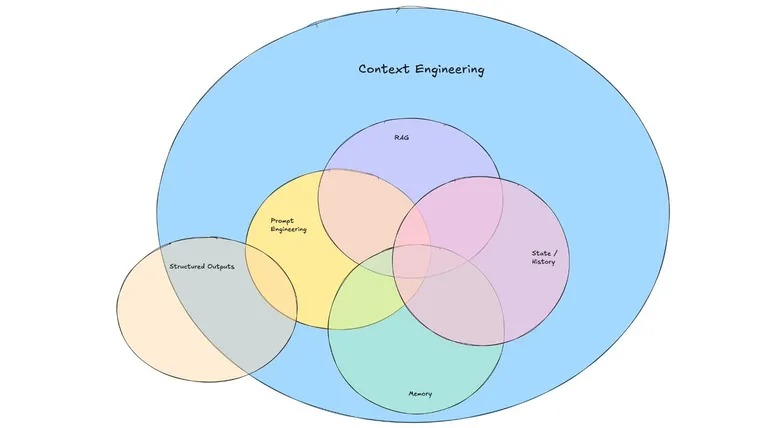

# Context Engineering

[Rise of Context Engineering](https://blog.langchain.com/the-rise-of-context-engineering/)

[How to Fix Your Context](https://www.dbreunig.com/2025/06/26/how-to-fix-your-context.html)

https://contextengineer.org/



**Prompt engineering** and **context engineering** are closely related but distinct concepts in working with language models like ChatGPT. Here's a clear breakdown of the difference:

---

### 🔹 **Prompt Engineering**

**Definition:**
The art and science of crafting effective **inputs (prompts)** to a language model to get the desired output.

**Focus:**

* Wording of the prompt
* Structure (e.g., instructions, format, tone)
* Using techniques like zero-shot, few-shot, chain-of-thought prompting

**Goal:**
To **optimize the immediate response** by designing the best possible query.

**Example:**

```plaintext
Prompt: "Explain quantum entanglement to a 10-year-old using a cartoon analogy."
```

---

### 🔹 **Context Engineering**

**Definition:**
The strategic design and management of **the broader context** in which a prompt is placed — often via additional background information, memory, history, tools, or system-level instructions.

**Focus:**

* What **surrounds** or **informs** the prompt
* Preloaded knowledge, retrieved documents, conversation history, user profile, etc.
* Long-term coherence or adaptation

**Goal:**
To **shape the model's behavior over a session or task**, not just a single response.

**Example:**

* Adding relevant documents to context using a retrieval system
* Feeding in prior conversation turns or user preferences
* Using system prompts like:
  `"You are a helpful assistant for legal research."`

---

### 🚀 Analogy

Think of it like a stage play:

* **Prompt engineering** is writing a good line for an actor to say.
* **Context engineering** is setting up the whole scene — lighting, background, script, and character roles — so that line makes sense and hits the right tone.

---

### Summary Table

| Feature      | Prompt Engineering                | Context Engineering                         |
| ------------ | --------------------------------- | ------------------------------------------- |
| Scope        | One-shot or few-shot input text   | Surrounding information and memory          |
| Focus        | Crafting clear, effective prompts | Structuring session-wide understanding      |
| Used in      | Basic queries, single-turn tasks  | Multi-turn chat, agent workflows, retrieval |
| Example Tool | Prompt templates                  | Vector databases, system prompts, memory    |

---

Sure! Here's a **comprehensive tutorial on Context Engineering**, ideal for developers, product designers, and AI enthusiasts working with language models.

---

# 🧠 **Context Engineering Tutorial**

**Designing Context for Smarter, More Capable Language Models**

---

## 🧩 1. What Is Context Engineering?

**Context engineering** is the practice of designing, managing, and injecting **relevant information** into a language model's input to improve performance, coherence, and utility — especially across **multi-turn conversations**, **tool use**, or **retrieval-augmented tasks**.

> 🧠 Context = Everything the model "knows" **at the moment of response**, including:

* The current prompt
* Chat history
* Retrieved documents
* System instructions
* User profile/preferences
* Tool outputs (APIs, databases)

---

## 🔧 2. Why Context Engineering Matters

### Without context:

* Outputs may be vague, inconsistent, or redundant
* Models forget previous turns in conversations
* Important facts or documents are ignored

### With context:

* Interactions feel **smart and adaptive**
* Long-term memory or personalization becomes possible
* You can simulate reasoning over large corpora

---

## 🗂️ 3. Types of Context

### 3.1 🔹 **Immediate Prompt Context**

* The actual text input
* Few-shot examples
* Instructions and goals

### 3.2 🔹 **System Instructions**

* Guides the assistant’s **overall behavior**
* E.g., `"You are a helpful career coach."`

### 3.3 🔹 **Conversation History**

* Turn-by-turn chat context
* Supports multi-turn reasoning, memory, clarification

### 3.4 🔹 **Retrieved Documents**

* Factual grounding from external sources (via RAG)
* Injected using embeddings + vector search

### 3.5 🔹 **Tool Outputs / APIs**

* Results from tools (like calculators, code runners, APIs)
* Fed into context for synthesis or follow-up

### 3.6 🔹 **User Memory / Profile**

* Known preferences, past behavior
* Used for personalization and continuity

---

## 🏗️ 4. Core Techniques

### ✅ A. Chunk and Inject (Retrieval-Augmented Generation)

1. Break source content into **chunks**
2. Use embeddings to **vectorize** and **search** relevance
3. Inject relevant chunks into the prompt dynamically

> 🔍 Example: Search a knowledge base and prepend top 3 matching docs to the prompt

---

### ✅ B. Memory Windows

* Decide how much **past dialogue** to keep
* Balance **coherence** with **token limits**

> 📌 Strategy: Retain only the most **relevant** turns using scoring (e.g., attention-based or semantic similarity)

---

### ✅ C. Structured Prompts

* Use templates to enforce clarity and control

```text
SYSTEM: You are a legal assistant.
USER: Summarize the following case.
[Document Text]
```

---

### ✅ D. Tool Use + Context Sync

* Combine external tools (e.g., calculators, web search)
* Feed **results back** into the model context

```text
USER: What’s the weather in Tokyo today?
TOOL: [Calls weather API]
ASSISTANT: It’s 28°C and sunny in Tokyo today.
```

---

### ✅ E. Context Filtering

* Use logic or embeddings to filter what context is **relevant** to the current prompt
* Reduces noise and token usage

---

## 🧪 5. Building a Context-Engineered Pipeline

### Example: Legal Research Assistant

**Goal:** Let a user ask legal questions and get grounded answers.

#### Step-by-Step:

1. **System Prompt**
   `"You are an expert legal assistant. Answer based on the documents provided."`

2. **User Input**
   `"What are the key facts in the 2023 XYZ vs ABC case?"`

3. **Search Legal DB**
   → Use vector search to retrieve top 3 case summaries

4. **Construct Prompt:**

   ```plaintext
   [System Prompt]
   [Context Docs]
   USER: What are the key facts in the 2023 XYZ vs ABC case?
   ```

5. **Model Response**
   → Model answers based only on relevant, real data

---

## 🛠️ 6. Tools & Frameworks

| Tool                             | Purpose                                  |
| -------------------------------- | ---------------------------------------- |
| **LangChain**                    | Orchestrate multi-step chains and memory |
| **LlamaIndex**                   | Build and query document indexes         |
| **Pinecone / Weaviate / FAISS**  | Vector databases for retrieval           |
| **OpenAI Functions / Tools API** | Integrate structured tool calls          |
| **JSON mode / Function calling** | Parse and handle structured output       |

---

## ⚖️ 7. Best Practices

* ✅ Use **token-efficient** context: prune irrelevant history
* ✅ Combine system prompt + user prompt + retrieved context
* ✅ Avoid "stuffing" too much — focus on **relevance**
* ✅ Monitor token limits (e.g., 4K–128K tokens depending on model)
* ✅ Add **metadata** like source titles and timestamps to context
* ✅ Test iteratively: small changes in context can drastically affect results

---

## 🧠 8. Advanced Context Patterns

* **Hierarchical Memory**: Short-term (chat history) + Long-term (user facts)
* **Context Graphs**: Structured relationships between facts or entities
* **Hybrid Context**: Mix structured data, natural language, and API results
* **Auto-context agents**: Agents that fetch and assemble their own context before responding

---

## 🧭 9. Summary

| Topic            | Key Idea                                           |
| ---------------- | -------------------------------------------------- |
| What is context? | All information the model "sees" during a response |
| Why use it?      | Enables grounding, coherence, personalization      |
| Techniques       | Retrieval, memory windows, tool output injection   |
| Tools            | LangChain, LlamaIndex, vector DBs, OpenAI Tools    |
| Best practice    | Relevance over quantity, modular prompts           |

---


