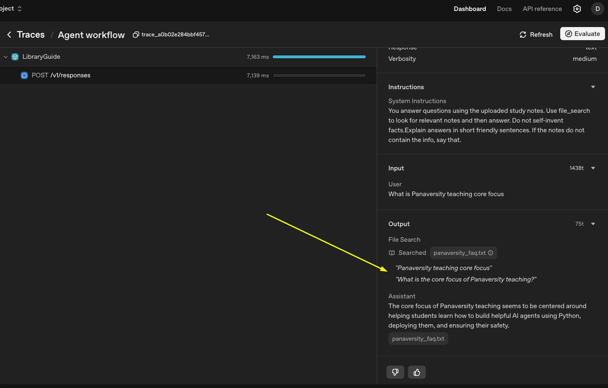

# Stage 29 – Managed (Agentic) RAG with OpenAI Vector Stores

This lesson teaches the Retrieval-Augmented Generation (RAG) basics and then shows how to skip running your own database by using OpenAI’s hosted vector stores. We use the Agent SDK’s `FileSearchTool`, which turns retrieval into a tool the agent can call on demand. 

Think of it as “Agentic RAG”: the agent decides when to fetch facts, then blends them into its answer. The whole lesson stays in Python and Chainlit.

## Quick Concept Check

- **Why RAG?** Models forget details. RAG keeps the latest notes outside the model and pastes them in only when needed. That keeps answers current and grounded.
- **Why managed RAG?** Hosting your own vector database takes time and money. OpenAI’s managed vector stores handle storage, indexing, and scaling for you.
- **Why Agentic RAG?** Instead of stuffing context into every prompt, the agent calls a retrieval tool when it detects that the user asked for facts. Tools = actions for the agent.

## How the Pipeline Works

1. **Collect notes** – Place your study material (text files, transcripts, etc.) in one folder.
2. **Chunk the text** – The vector store breaks long files into smaller pieces so the model can judge relevance.
3. **Create embeddings** – Each chunk becomes a vector (a list of numbers) that captures meaning.
4. **Store vectors** – The managed store keeps those vectors and their source metadata.
5. **Retrieve when needed** – Our agent calls the `FileSearchTool`, which returns the best chunks for the current question.
6. **Generate the answer** – The agent feeds the retrieved chunks plus the user’s question to the model to craft a grounded reply.

## What You Will Build

- A managed vector store created in the OpenAI dashboard.
- A Chainlit agent that can search that store with the `FileSearchTool`.
- A friendly chat that relies on the stored notes for answers.



## Folders and Files

```
29_managed_rag_service/
├── README.md                  # You are reading it now
├── .env.example               # Copy to .env with your secrets
├── pyproject.toml             # uv keeps track of dependencies here
├── prepare_vector_store.py    # Optional helper to sync many files at once
├── main.py                    # Chainlit app that uses the managed store
└── docs/
    └── panaversity_faq.txt    # Sample file to upload
```

## Step 1 – Set Up `uv`

We will let `uv` track our dependencies.

```bash
cd 29_managed_rag_service
uv init .
uv venv
source .venv/bin/activate
uv add chainlit openai python-dotenv agents
```

The last command writes the packages into `pyproject.toml` and installs them into the virtual environment.

## Step 2 – Fill in the Secrets

Copy the example file and add your own keys.

```bash
cp .env.example .env
```

Open `.env` and set:

```
OPENAI_API_KEY=sk-...
```

Leave `OPENAI_VECTOR_STORE_ID` blank for now. We will fill it after creating the vector store.

## Step 3 – Create the Managed Vector Store in the Dashboard

1. Go to [platform.openai.com](https://platform.openai.com/) and sign in.
2. Open the **Data** section and choose **Vector stores**.
3. Click **Create vector store**.
4. Give it a friendly name like `panaversity-notes`, then click **Create**.
5. Upload the sample file `docs/panaversity_faq.txt` from this folder (or upload your own notes).
6. After the upload finishes, copy the **Vector store ID** (it starts with `vs_...`). You can find it in the store details panel.

Add that ID to `.env`:

```
OPENAI_VECTOR_STORE_ID=vs_...
```

Keep the ID safe. You will use the same store for every agent that needs these notes.

## Step 4 – Start the Chainlit App

```bash
chainlit run main.py -w
```

Visit the link in your browser. Ask a question like:

> How many hours should I study each week?

The agent will decide when it needs the notes, call the hosted `FileSearchTool`, read the FAQ file, and answer based on the snippets it found.

## Step 5 – Explore Further

- Upload your own notes by editing `docs/`. Run the setup script again when you add new files.
- Change `max_num_results` in `main.py` to adjust how many snippets the agent reads.
- Pair this with the deployment steps from Stage 28 to host a managed-RAG assistant.

You now know how to mix your data with OpenAI’s managed retrieval tools. This unlocks larger documents without running any extra servers. Nice work!
