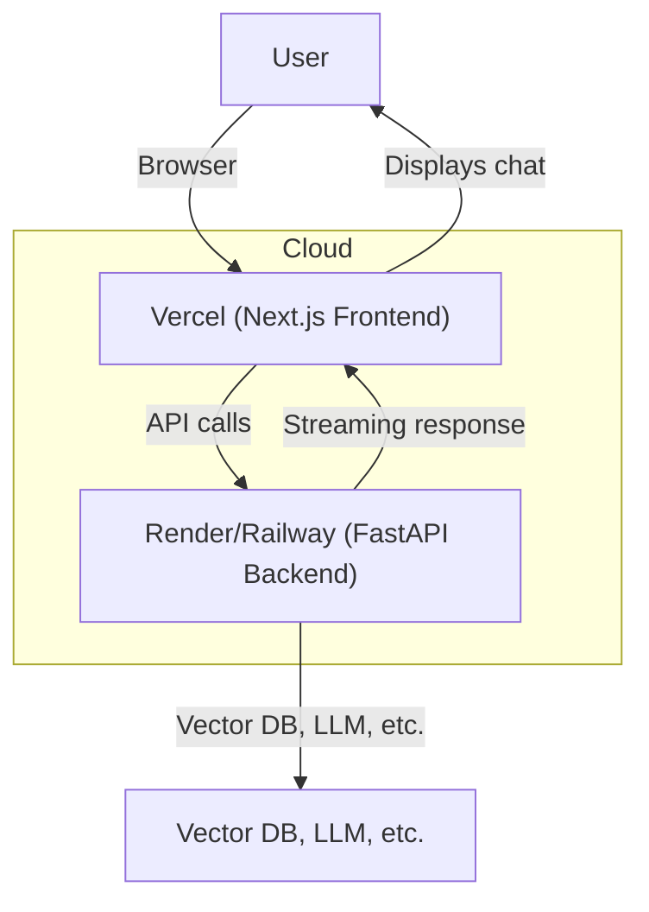

# Advanced Functionality Guide: Agentic RAG Chatbot

Welcome to the Advanced phase of the Agentic RAG Chatbot project! In this phase, you'll learn how to containerize your backend, deploy both backend and frontend to the cloud, and test your live, production-ready chatbot.

---

## Phase Overview

- **Dockerization:** Package your FastAPI backend as a Docker container for portability and reproducibility.
- **Cloud Deployment:** Deploy your FastAPI backend to a free cloud service (e.g., Render, Railway, or similar).
- **Frontend Deployment:** Deploy your Next.js frontend to Vercel for public access.
- **Live Testing:** Test and interact with your deployed Agentic RAG Chatbot from anywhere.

## Learning Goals

- Build and optimize a Docker image for your FastAPI backend.
- Deploy backend and frontend to cloud platforms.
- Configure environment variables and secrets for production.
- Troubleshoot common deployment issues.

---

## Step 1: Dockerize the FastAPI Backend

1. **Create a Dockerfile in your FastAPI backend directory:**
   ```dockerfile
   # Dockerfile
   FROM python:3.10-slim
   WORKDIR /app
   COPY . .
   RUN pip install --upgrade pip && pip install -r requirements.txt
   EXPOSE 8000
   CMD ["uvicorn", "app.main:app", "--host", "0.0.0.0", "--port", "8000"]
   ```
2. **Build the Docker image:**
   ```bash
   docker build -t agentic-rag-backend .
   ```
3. **Run the container locally to test:**
   ```bash
   docker run -p 8000:8000 agentic-rag-backend
   ```

---

## Step 2: Deploy FastAPI Backend to the Cloud

- **Render:**

  1. Push your backend code to GitHub.
  2. Create a new Web Service on [Render](https://render.com/), connect your repo, and set the build/start commands:
     - Build: `pip install --upgrade pip && pip install -r requirements.txt`
     - Start: `uvicorn app.main:app --host 0.0.0.0 --port 8000`
  3. Add environment variables (e.g., API keys, DB URLs) in the Render dashboard.
  4. Deploy and note your public API URL.

- **Railway:**
  1. Push your backend code to GitHub.
  2. Create a new project on [Railway](https://railway.app/), link your repo, and deploy.
  3. Set environment variables as needed.
  4. Note your public API URL.

---

## Step 3: Deploy Next.js Frontend to Vercel

1. Push your `agentic-rag-frontend` directory to GitHub (separate repo or subfolder).
2. Go to [Vercel](https://vercel.com/) and import your repo.
3. Set the `NEXT_PUBLIC_API_URL` environment variable to your deployed FastAPI backend URL.
4. Deploy and get your public frontend URL.

---

## Step 4: Live Testing & Troubleshooting

- Visit your Vercel frontend URL and interact with the chatbot.
- Check browser console and Vercel/Render/Railway logs for errors.
- Common issues:
  - CORS errors: Ensure your FastAPI backend allows requests from your frontend domain.
  - Environment variables: Double-check API URLs and secrets.
  - Build failures: Check Dockerfile, requirements, and logs.

---

## Recommended Production Folder Structure

```
Agentic-rag/
├── basic/
├── intermediate/
├── advanced/
├── agentic-rag-frontend/   # Next.js frontend (deployed to Vercel)
└── app/                    # FastAPI backend (deployed to Render/Railway)
```

---

## Deployment Architecture Diagram



---

## Next Steps

- Monitor your deployed services for uptime and errors.
- Add analytics, logging, and security hardening for production.
- Share your live Agentic RAG Chatbot with users!
