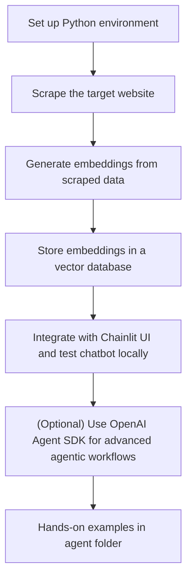

> **Note:** Before starting, make sure you have completed the [Python environment setup](../README.md#step-1-set-up-your-python-environment) in the main README.



# Basic Functionality Guide

This guide covers the first phase of the Agentic RAG Chatbot project: scraping a website, creating embeddings, storing them in a vector database, and connecting to a Chainlit UI for local testing.

## What is Web Scraping?

Web scraping is the process of automatically extracting data from websites. It allows you to collect large amounts of information from web pages, which can then be used for analysis, building datasets, powering chatbots, and more. In the context of this project, web scraping is used to gather relevant content from a target website to feed into your chatbot's knowledge base.

### Why is Web Scraping Important?

- **Automates Data Collection:** Saves time and effort compared to manual copy-pasting.
- **Keeps Data Up-to-Date:** Enables regular updates from dynamic websites.
- **Powers Data-Driven Applications:** Essential for building search engines, chatbots, and data analysis tools.

## Latest Python Tools for Web Scraping (2024)

Python offers a rich ecosystem of libraries for web scraping, ranging from simple HTML parsing to advanced, browser-based automation. Here are some of the latest and most popular tools:

- **BeautifulSoup:** Classic library for parsing HTML and XML documents. Great for simple scraping tasks.
- **Requests:** Used for making HTTP requests to fetch web pages. Often used with BeautifulSoup.
- **Selenium:** Automates browsers for scraping dynamic, JavaScript-heavy sites. Supports Chrome, Firefox, etc.
- **Playwright:** Modern alternative to Selenium, supports multiple browsers and is known for speed and reliability.
- **Scrapy:** Powerful and scalable web scraping framework for large projects. Handles crawling, data extraction, and more.
- **crawlerforge:** Advanced Scrapy-based framework with multi-engine support, intelligent proxy management, and anti-detection features. [PyPI](https://pypi.org/project/crawlerforge/)
- **better-scraper:** New library for web search and scraping, integrates with LLMs for query expansion and answer generation. [PyPI](https://pypi.org/project/better-scraper/)
- **dispider:** Toolkit for quickly deploying and managing crawlers in batches, beginner-friendly. [PyPI](https://pypi.org/project/dispider/)
- **crawl4ai:** Modern AI-powered web crawler designed for large-scale, intelligent data extraction. Integrates with LLMs and supports advanced anti-bot features. [PyPI](https://pypi.org/project/crawl4ai/)

> **Note:** Always respect website terms of service and robots.txt when scraping. Use proxies and rate limiting to avoid being blocked.

---

## Steps

1. **Set up your Python environment**
2. **Scrape the target website**
3. **Generate embeddings from the scraped data**
4. **Store embeddings in a vector database**
5. **Integrate with Chainlit UI and test chatbot locally**

_Detailed instructions for each step will be provided below as you progress through the phase._

---

## Step 2: Scrape the Target Website

In this step, you will extract relevant content from your chosen website. Web scraping allows you to collect data that will form the knowledge base for your chatbot. The quality and structure of your scraped data will directly impact the chatbot's performance.

### Why Scrape?

- To gather up-to-date, domain-specific information.
- To automate the collection of large datasets for downstream processing.

### How to Scrape

Choose a Python tool that fits your needs (see the list above). For most projects, tools like BeautifulSoup, Playwright, or crawl4ai are recommended for their balance of power and ease of use.

**See the [`crawl4ai_examples`](./crawl4ai_examples/) directory for hands-on code samples using crawl4ai.**

> _Tip: Always check the website’s terms of service and robots.txt before scraping. Use polite scraping practices (rate limiting, user-agent headers, etc.)._

---

## Step 3: Generate Embeddings from the Scraped Data

### What are Embeddings?

Embeddings are numerical representations of text (or other data types) in a high-dimensional vector space. In the context of natural language processing (NLP), embeddings capture the semantic meaning of words, sentences, or documents, allowing similar pieces of text to have similar vector representations.

Popular embedding models include OpenAI's text-embedding-ada-002, Google's Universal Sentence Encoder, and many open-source alternatives.

### Why are Embeddings Important?

- **Semantic Search:** Embeddings enable efficient semantic search, allowing you to find relevant information based on meaning, not just keywords.
- **Clustering & Classification:** They help group similar documents and support downstream machine learning tasks.
- **Contextual Retrieval:** In Retrieval-Augmented Generation (RAG) systems, embeddings are used to match user queries with the most relevant pieces of your scraped data, providing context to the LLM for better answers.

### Role in RAG Systems

After scraping and cleaning your data, you convert each chunk (e.g., paragraph, section, or document) into an embedding. When a user asks a question, the system converts the query into an embedding and retrieves the most similar data chunks from your vector database. These chunks are then provided as context to the LLM, enabling accurate, context-aware responses.

> **Next:** You'll learn how to generate embeddings from your scraped data and store them in a vector database for fast retrieval.

---

## Step 4: Store Embeddings in a Vector Database

### What is a Vector Database?

A vector database is a specialized database designed to efficiently store, index, and search high-dimensional vector data—such as embeddings generated from text, images, or other data types. In RAG and AI search systems, vector databases enable fast and accurate similarity search, allowing you to retrieve the most relevant content for a given query.

### Why Use a Vector Database?

- **Efficient Similarity Search:** Find the most relevant documents or chunks based on vector similarity (e.g., cosine similarity, Euclidean distance).
- **Scalability:** Handle millions or billions of embeddings with high performance.
- **Integration:** Many vector DBs offer APIs and integrations with popular AI and search frameworks.

### Popular Vector Databases (2025)

- **Pinecone:** Fully managed, cloud-native vector database with strong API support and integrations.
- **Weaviate:** Open-source, feature-rich vector database with hybrid search and modular architecture.
- **Qdrant:** Open-source, high-performance vector DB with REST/gRPC APIs and filtering capabilities.
- **Chroma:** Open-source, developer-friendly vector DB designed for LLM and RAG workflows.
- **Milvus:** Highly scalable, open-source vector database for large-scale AI applications.
- **FAISS:** Facebook’s library for efficient similarity search, often used as a local or embedded solution.
- **Redis (Vector):** Redis now supports vector search as part of its core features, suitable for smaller-scale or hybrid use cases.

> **Note:** Most vector DBs support storing metadata alongside vectors, filtering, and integration with Python, LangChain, LlamaIndex, and other AI frameworks.

---

## Step 5: Integrate with Chainlit UI and Test Chatbot Locally

### What is Chainlit?

Chainlit is an open-source Python framework for building beautiful, interactive chat interfaces for LLM-powered applications—without needing to write any frontend code. It’s designed for rapid prototyping, internal tools, and production-ready conversational AI apps.

**Key Features:**

- Python-first: Build your chatbot UI entirely in Python, no JavaScript or React required.
- Streaming Support: Real-time streaming of LLM responses for a modern chat experience.
- Rich UI: Supports markdown, code blocks, images, custom elements, and more.
- Authentication: Built-in support for login, OAuth, and user management.
- Session & Memory: Easily manage chat history, user sessions, and state.
- Tool/Agent Integration: Seamlessly connect to OpenAI, LangChain, LlamaIndex, and vector DBs.
- Extensible: Add custom chat profiles, settings, and even your own React components if needed.

**Why use Chainlit?**

- No need to build a frontend from scratch.
- Focus on your LLM logic and agent workflows.
- Professional, modern UI out of the box.
- Easy to deploy locally or in the cloud.

**Getting Started:**

```bash
uv add chainlit
chainlit hello
```

Or run your own app:

```bash
chainlit run app.py
```

Official site: [chainlit.io](https://chainlit.io/)

**Minimal Chainlit Chatbot Example:**

```python
import chainlit as cl

@cl.on_chat_start
async def start():
    await cl.Message("How can I help you today?").send()

@cl.on_message
async def main(message: str):
    # Replace with your LLM/agent logic
    response = "You said: " + message
    await cl.Message(response).send()
```

**References:**

- [Chainlit Official Docs](https://docs.chainlit.io/)
- [Chainlit on GitHub](https://github.com/Chainlit/chainlit)
- [Chainlit LLM App Guide (2025)](https://medium.com/mitb-for-all/its-2025-start-using-chainlit-for-your-llm-apps-558db1a46315)

---

### About the OpenAI Agent SDK

The OpenAI Agent SDK is a toolkit for building agentic applications that can reason, plan, and use tools (functions, APIs, plugins) in a conversational context. It’s designed to make it easy to build advanced LLM-powered agents that can:

- Use tools and APIs (function calling)
- Maintain memory and context
- Orchestrate multi-step workflows
- Integrate with frameworks like Chainlit, LangChain, and LlamaIndex

**References:**

- [Agent SDK Tools](https://openai.github.io/openai-agents-python/tools/)
- [OpenAI Agent SDK (GitHub)](https://github.com/openai/openai-python)

---

> \*\*Hands-on examples for Chainlit and OpenAI Agent SDK will be available in the `agent` folder. Project installation and dependencies are managed with UV for consistency and speed.
