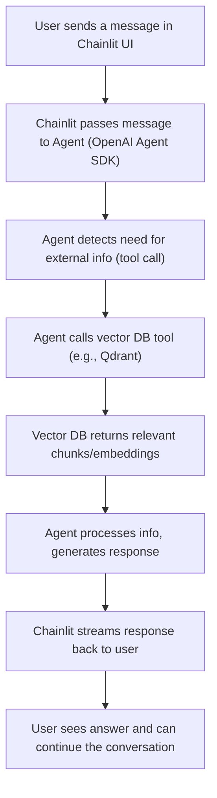
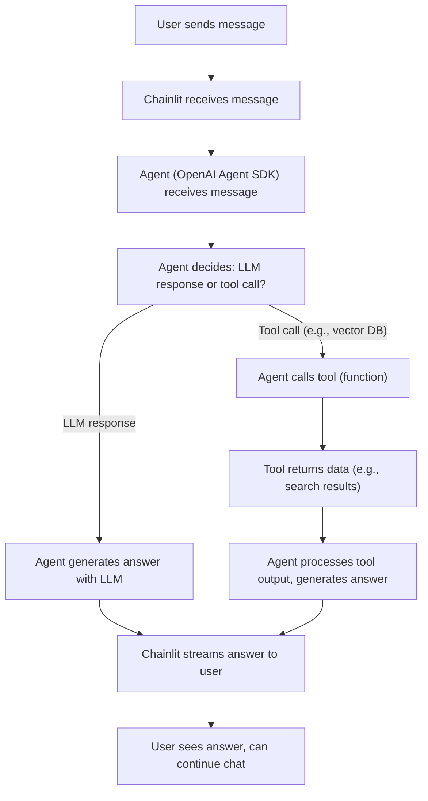
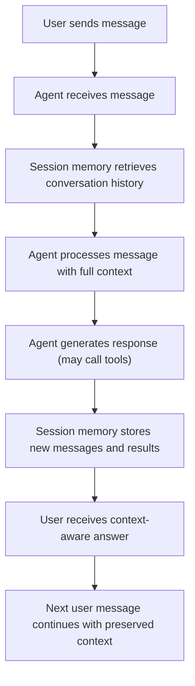

# Agent Examples: Chainlit & OpenAI Agent SDK

## Agentic Chatbot Flow (with Tool + Vector DB)

Below is the high-level flow for an agentic chatbot that uses a tool to call a vector database (e.g., Qdrant), processes the information, and returns the result to the user:



---

## Agent Workflow: Decision and Tool Use

This diagram shows how an agent (using the OpenAI Agent SDK) processes a user message, decides whether to respond directly or call a tool (like a vector DB), and returns the answer to the user:



---

## Importance of Session Memory in Agentic Chatbots

Session memory is critical for building conversational agents that can remember previous interactions, maintain context, and provide coherent, context-aware responses across multiple turns. With session memory, your agent can:

- Track conversation history automatically (no manual state management needed)
- Reference earlier user questions and its own answers
- Support corrections, follow-ups, and multi-step workflows
- Enable persistent, multi-session conversations (e.g., per user, per thread)

The [OpenAI Agents SDK](https://openai.github.io/openai-agents-python/sessions/) provides built-in session memory (e.g., SQLiteSession) that makes it easy to add this capability to your agentic apps.

### Session Memory Flow Diagram



**Why is this important?**

- Without session memory, the agent would treat every message as a new, stateless request—losing all context and making multi-turn conversations impossible.
- With session memory, the agent can answer follow-up questions, reference earlier topics, and provide a much more natural, helpful user experience.

---

# Purpose

- Demonstrate how to build interactive chatbots and agent workflows with minimal Python code.
- Show integration of Chainlit UI and OpenAI's latest agentic features.
- Provide a starting point for your own agentic RAG, tool-using, or conversational AI projects.

## Included Examples

- `chainlit_hello.py` — Minimal Chainlit chatbot (echo bot, ready for LLM/agent logic)
- `openai_agent_sdk_example.py` — Official OpenAI Agent SDK "Hello World" example (see [OpenAI Agents SDK Docs](https://openai.github.io/openai-agents-python/))
- `session_tool_example.py` — OpenAI Agent SDK session memory example with both a weather tool and a vector DB tool. Demonstrates context preservation and multi-tool use in a conversation.

## Usage

1. **Install dependencies (with UV):**

   ```bash
   uv add chainlit openai openai-agents
   ```

2. **Run the Chainlit example:**

   ```bash
   chainlit run chainlit_hello.py
   ```

3. **Run the OpenAI Agent SDK Hello World example:**

   ```bash
   python openai_agent_sdk_example.py
   ```

   - Make sure you have set your `OPENAI_API_KEY` environment variable.

4. **Run the session + tool example:**
   ```bash
   python session_tool_example.py
   ```
   - This will show the agent remembering context and using both the weather and vector DB tools as needed.

## References

- [Chainlit Official Docs](https://docs.chainlit.io/)
- [OpenAI Agents SDK Docs](https://openai.github.io/openai-agents-python/)

---

> **Tip:** Use these examples as a foundation for more advanced agentic workflows, tool integration, and RAG-powered chatbots!
