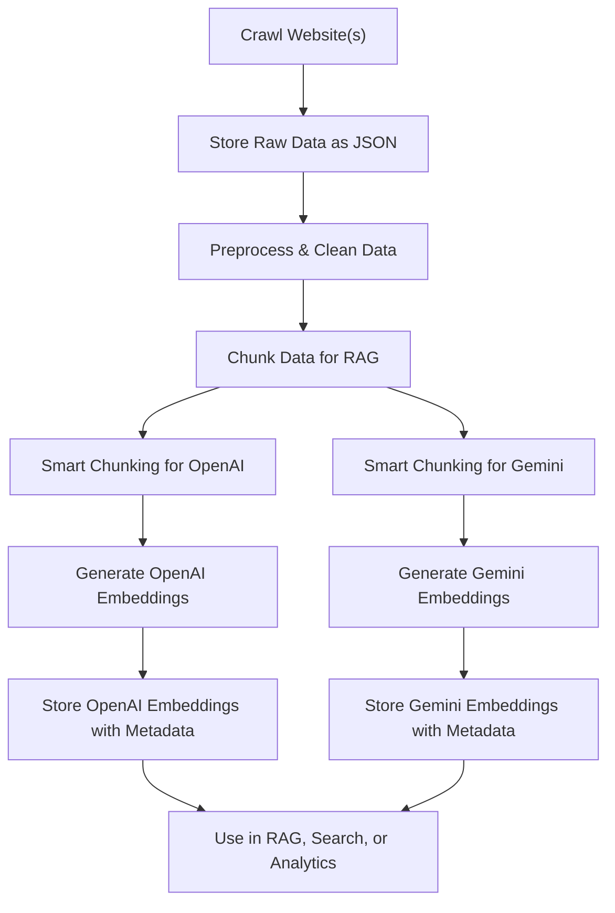

# Embeddings Examples

This directory contains code samples for generating text embeddings using popular APIs such as Google Gemini and OpenAI.

## RAG Pipeline Workflow

Below is a high-level workflow for preparing and embedding data for Retrieval-Augmented Generation (RAG) systems:



---

## What are Embeddings?

Embeddings are vector representations of text that capture semantic meaning, enabling powerful search, clustering, and retrieval capabilities in AI systems.

## Official Documentation

- [Google Gemini Embeddings (Python)](https://ai.google.dev/gemini-api/docs/embeddings#python)
- [OpenAI Embeddings (Python)](https://platform.openai.com/docs/guides/embeddings)

## Example Scripts

- google_gemini_embeddings.py — Generate embeddings using Google Gemini API
- openai_embeddings.py — Generate embeddings using OpenAI API
- generic_rag_preprocessor.py — **Preprocess and chunk crawled data for RAG**
- openai_smart_chunker.py — **Smart chunking for OpenAI embeddings using tiktoken**
- gemini_smart_chunker.py — **Smart chunking for Gemini embeddings (token estimate)**
- generate_openai_embeddings.py — **Generate OpenAI embeddings from chunked RAG data**
- generate_gemini_embeddings.py — **Generate Gemini embeddings from chunked RAG data**

## How to Use: Run, Store, Chunk, and Generate Embeddings

1. **Run a Crawl Script**
   - Use a script like `deep_crawl_to_json.py` (see the `../crawl4ai_examples/` directory) to crawl a website and store the results locally as JSON files.
   - Example:
     ```bash
     python ../crawl4ai_examples/deep_crawl_to_json.py
     ```
2. **Store Data in JSON**
   - The script will save a JSON file for each crawled page (with cleaned content, metadata, etc.) and a summary file in a `data/` subdirectory.
3. **Preprocess for RAG**
   - Use `generic_rag_preprocessor.py` to clean, normalize, and chunk your crawled data, making it ready for embeddings and retrieval-augmented generation (RAG) workflows.
   - Example:
     ```bash
     python generic_rag_preprocessor.py
     ```
   - This will read all JSON files in `data/crawlers_json/`, process and chunk the text, and output a single RAG-ready file at `data/rag_ready/rag_ready_data.json`.
   - Each entry in the output is cleaned, optionally chunked, and includes metadata for traceability.
4. **Smart Chunking for Embeddings**
   - Use the smart chunking scripts to further split your RAG-ready data into model-optimized chunks:
     - For **OpenAI** (uses tiktoken):
       ```bash
       python openai_smart_chunker.py
       ```
       - Reads: `data/rag_ready/rag_ready_data.json`
       - Outputs: `data/openai_chunked/openai_chunked_data.json`
     - For **Gemini** (token estimate):
       ```bash
       python gemini_smart_chunker.py
       ```
       - Reads: `data/rag_ready/rag_ready_data.json`
       - Outputs: `data/gemini_chunked/gemini_chunked_data.json`
   - These scripts ensure each chunk fits within the model's token limit, optimizing for cost and performance.
5. **Generate Embeddings**
   - Use the embedding generation scripts to create vector embeddings from your chunked RAG data:
     - For **OpenAI**:
       ```bash
       python generate_openai_embeddings.py --input data/openai_chunked/openai_chunked_data.json --output data/embeddings/openai_embeddings_with_metadata.json
       ```
       - Requires: `OPENAI_API_KEY` environment variable
       - Supports: batching, rate limiting, and custom model/dimensions via env or CLI
       - Output: `data/embeddings/openai_embeddings_with_metadata.json`
     - For **Gemini**:
       ```bash
       python generate_gemini_embeddings.py --input data/gemini_chunked/gemini_chunked_data.json --output data/embeddings/gemini_embeddings_with_metadata.json
       ```
       - Requires: `GOOGLE_API_KEY` environment variable
       - Supports: batching, rate limiting, and custom model/dimensions via env or CLI
       - Output: `data/embeddings/gemini_embeddings_with_metadata.json`

## Environment Variables

- `OPENAI_API_KEY`: Your OpenAI API key (required for OpenAI scripts)
- `GOOGLE_API_KEY`: Your Gemini API key (required for Gemini scripts)
- `BATCH_SIZE`: Number of texts per batch (default: 100)
- `RATE_LIMIT_DELAY`: Delay between batches in seconds (default: 1)
- `EMBEDDING_MODEL` / `GEMINI_MODEL`: Model name (see script defaults)
- `EMBEDDING_DIMENSIONS`: Embedding dimensions (default: 1536)

You can also use a `.env` file in the project root to set these variables.

## Outputs

- Chunked data and embeddings are saved in the `data/` subdirectories with full metadata for downstream RAG, search, or analytics workflows.

> **Contributions welcome!** Add your own examples or tips to help others learn about embeddings, RAG preprocessing, smart chunking, and embedding generation.
