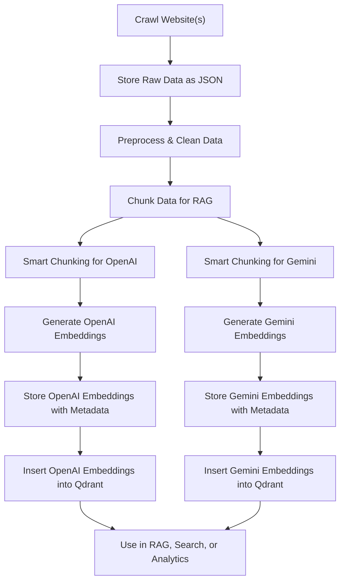

# Qdrant Vector Database

## RAG + Vector DB Workflow

Below is a high-level workflow for preparing, embedding, and storing data in a vector database (Qdrant) for Retrieval-Augmented Generation (RAG) systems:



---

Qdrant is a modern, open-source vector database designed for storing, indexing, and searching high-dimensional vector embeddings. It’s widely used in AI, RAG, and semantic search applications due to its performance, filtering capabilities, and easy integration with Python and popular frameworks.

## Why Qdrant?

- **Open Source & Free:** No vendor lock-in, can run locally or in the cloud.
- **Fast & Scalable:** Handles millions of vectors with high performance.
- **Filtering:** Supports metadata filtering alongside vector search.
- **Rich API:** REST and gRPC APIs, plus a Python client.
- **Integrations:** Works well with LangChain, LlamaIndex, and other AI tools.

## How to Use Qdrant in Python

1. **Install Qdrant Client:**

   ```bash
   uv add qdrant-client
   ```

2. **Start Qdrant (Docker):**

   ```bash
   docker run -p 6333:6333 -p 6334:6334 qdrant/qdrant
   ```

   This runs Qdrant locally on port 6333 (REST) and 6334 (gRPC).

3. **Basic Python Example:**

   ```python
   from qdrant_client import QdrantClient
   from qdrant_client.models import PointStruct, VectorParams, Distance

   # Connect to local Qdrant
   client = QdrantClient("localhost", port=6333)

   # Create a collection (if not exists)
   client.recreate_collection(
       collection_name="my_vectors",
       vectors_config=VectorParams(size=1536, distance=Distance.COSINE)
   )

   # Insert vectors (example: 2 vectors)
   vectors = [
       PointStruct(id=1, vector=[0.1]*1536, payload={"text": "Hello world"}),
       PointStruct(id=2, vector=[0.2]*1536, payload={"text": "Goodbye world"}),
   ]
   client.upsert(collection_name="my_vectors", points=vectors)

   # Search for similar vectors
   search_result = client.search(
       collection_name="my_vectors",
       query_vector=[0.1]*1536,
       limit=2
   )
   for hit in search_result:
       print(hit.payload, hit.score)
   ```

---

## Inserting Embeddings into Qdrant

After generating your embeddings (with OpenAI or Gemini), you can insert them into Qdrant using the provided scripts:

### Add OpenAI Embeddings to Qdrant

- **Script:** `add_openai_embeddings_to_qdrant.py`
- **Input:** `data/embeddings/openai_embeddings_with_metadata.json`
- **Usage:**
  ```bash
  python add_openai_embeddings_to_qdrant.py
  ```
- **Requirements:**
  - `uv add qdrant-client`
  - Qdrant running locally (see above)

### Add Gemini Embeddings to Qdrant

- **Script:** `add_gemini_embeddings_to_qdrant.py`
- **Input:** `data/embeddings/gemini_embeddings_with_metadata.json`
- **Usage:**
  ```bash
  python add_gemini_embeddings_to_qdrant.py
  ```
- **Requirements:**
  - `uv add qdrant-client`
  - Qdrant running locally (see above)

Both scripts will create a new collection in Qdrant ("openai_vectors" or "gemini_vectors") and insert all embeddings with their metadata and payloads.

---

## Using Qdrant with LangChain

[LangChain](https://python.langchain.com/docs/integrations/vectorstores/qdrant) is a popular framework for building LLM-powered applications. It provides a simple interface to connect to Qdrant and use it as a vector store for retrieval-augmented generation (RAG) and semantic search.

**Install dependencies:**

```bash
uv add langchain qdrant-client
```

**Basic Example:**

```python
from langchain_community.vectorstores import Qdrant
from langchain_openai import OpenAIEmbeddings
from qdrant_client import QdrantClient

# Connect to Qdrant
qdrant_client = QdrantClient("localhost", port=6333)

# Create embeddings (using OpenAI as an example)
embeddings = OpenAIEmbeddings()

# Create or connect to a collection
vectorstore = Qdrant(
    client=qdrant_client,
    collection_name="my_vectors",
    embeddings=embeddings,
)

# Add documents
docs = ["Hello world", "Goodbye world"]
vectorstore.add_texts(docs)

# Perform a similarity search
results = vectorstore.similarity_search("Hello", k=2)
for doc in results:
    print(doc.page_content)
```

---

## Using Qdrant with LlamaIndex

[LlamaIndex](https://docs.llamaindex.ai/en/stable/examples/vector_stores/qdrant.html) is another popular framework for building RAG and LLM-powered search systems. It supports Qdrant as a vector store for efficient retrieval.

**Install dependencies:**

```bash
uv add llama-index-vector-stores-qdrant qdrant-client
```

**Basic Example:**

```python
from llama_index.vector_stores.qdrant import QdrantVectorStore
from llama_index.core import VectorStoreIndex, SimpleDirectoryReader
from qdrant_client import QdrantClient

# Connect to Qdrant
qdrant_client = QdrantClient("localhost", port=6333)

# Create a Qdrant vector store
vector_store = QdrantVectorStore(
    client=qdrant_client,
    collection_name="my_vectors",
)

# Load documents (from a directory, for example)
documents = SimpleDirectoryReader("./data").load_data()

# Create an index
index = VectorStoreIndex.from_documents(documents, vector_store=vector_store)

# Query the index
query_engine = index.as_query_engine()
response = query_engine.query("Hello world")
print(response)
```

---

## Resources

- [Qdrant Docs](https://qdrant.tech/documentation/)
- [Qdrant Python Client](https://qdrant.github.io/qdrant_client/)
- [Qdrant on GitHub](https://github.com/qdrant/qdrant)
- [LangChain Qdrant Integration](https://python.langchain.com/docs/integrations/vectorstores/qdrant)
- [LlamaIndex Qdrant Integration](https://docs.llamaindex.ai/en/stable/examples/vector_stores/qdrant.html)
