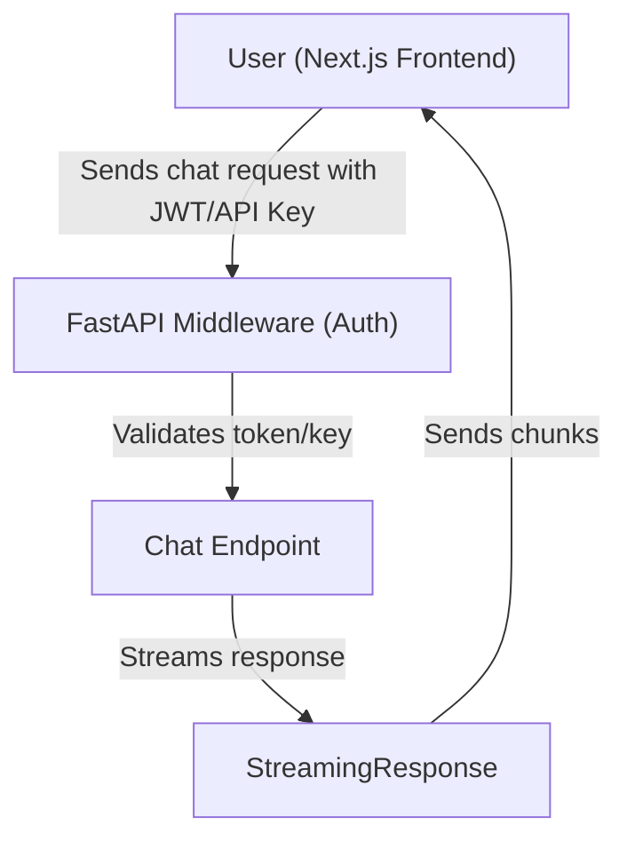
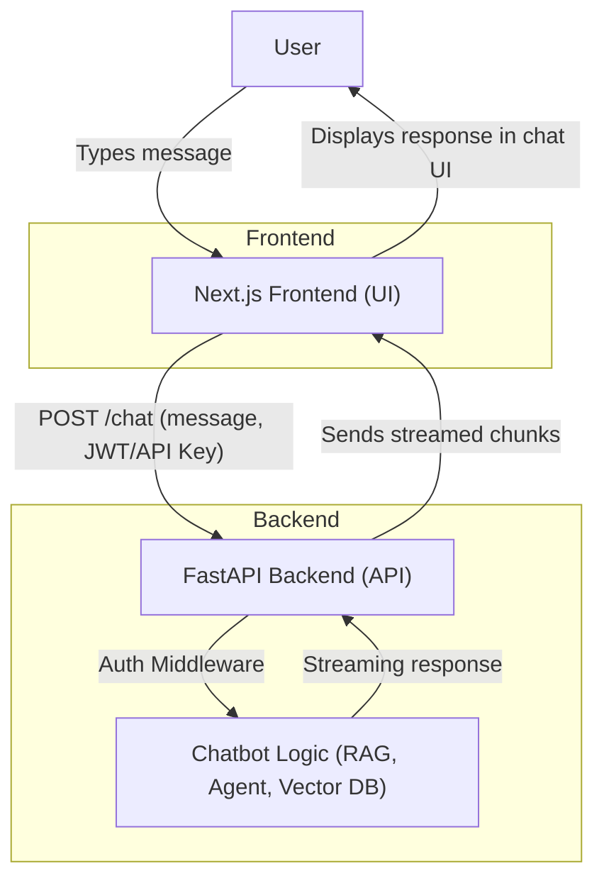

# Intermediate Functionality Guide: Agentic RAG Chatbot

Welcome to the Intermediate phase of the Agentic RAG Chatbot project! In this phase, you'll build a robust backend API for your chatbot and connect it to a modern web frontend.

---

## Requirements

- Python 3.9+
- [FastAPI](https://fastapi.tiangolo.com/)
- [Uvicorn](https://www.uvicorn.org/) (ASGI server)
- [python-jose](https://python-jose.readthedocs.io/en/latest/) (JWT authentication)
- [passlib](https://passlib.readthedocs.io/en/stable/) (password hashing, if needed)
- [httpx](https://www.python-httpx.org/) (for async HTTP calls, optional)
- [pydantic](https://docs.pydantic.dev/) (data validation)
- [python-dotenv](https://pypi.org/project/python-dotenv/) (for environment variables)

Install all requirements with:

```bash
uv add fastapi uvicorn python-jose passlib[bcrypt] httpx pydantic python-dotenv
```

---

## Security: Protecting All Routes

All API routes should be protected with authentication middleware. Common approaches:

- **JWT Authentication:** Use OAuth2 with JWT tokens for secure, stateless authentication.
- **API Key Middleware:** Require an API key in headers for each request.

Example (JWT):

```python
from fastapi import Depends, HTTPException, status
from fastapi.security import OAuth2PasswordBearer
from jose import JWTError, jwt

oauth2_scheme = OAuth2PasswordBearer(tokenUrl="/token")

async def get_current_user(token: str = Depends(oauth2_scheme)):
    try:
        payload = jwt.decode(token, SECRET_KEY, algorithms=[ALGORITHM])
        # ... user validation logic ...
    except JWTError:
        raise HTTPException(status_code=status.HTTP_401_UNAUTHORIZED, detail="Invalid token")
```

Apply this dependency to all protected routes.

---

## Recommended Backend Folder Structure

```
intermediate/
├── app/
│   ├── main.py           # FastAPI entrypoint
│   ├── api/              # Route definitions
│   │   ├── __init__.py
│   │   └── chat.py
│   ├── core/             # Core logic (auth, config, security)
│   │   ├── __init__.py
│   │   ├── auth.py
│   │   └── config.py
│   ├── models/           # Pydantic models
│   │   ├── __init__.py
│   │   └── chat.py
│   ├── services/         # Business logic (chatbot, vector db, etc.)
│   │   ├── __init__.py
│   │   └── rag.py
│   └── middleware.py     # Custom middleware (e.g., API key, CORS)
├── .env                  # Environment variables
├── requirements.txt      # (if needed)
└── README.md
```

---

## Flow Diagram: Frontend to FastAPI Backend (with Auth & Streaming)



---

## Phase Overview

- **Backend:** FastAPI for serving chatbot responses and handling retrieval-augmented queries.
- **Streaming:** Real-time streaming of chatbot responses for a smooth user experience.
- **API Docs:** Built-in FastAPI documentation for easy testing and exploration.
- **Frontend:** Next.js app that interacts with your FastAPI backend.

## Learning Goals

- Build and document REST APIs for your chatbot using FastAPI.
- Implement streaming responses for real-time chat.
- Test and document your APIs using FastAPI's auto-generated docs.
- Create a Next.js frontend and connect it to your backend.

---

## Step 1: Build a FastAPI Backend

1. **Install FastAPI and Uvicorn:**
   ```bash
   uv add fastapi uvicorn
   ```
2. **Create a basic FastAPI app:**

   ```python
   # main.py
   from fastapi import FastAPI

   app = FastAPI()

   @app.get("/")
   async def root():
       return {"message": "Agentic RAG Chatbot API is running!"}
   ```

3. **Run your API locally:**
   ```bash
   uvicorn main:app --reload
   ```

---

## Step 2: Implement Streaming Responses

- Use FastAPI's `StreamingResponse` to stream chatbot output as it's generated.
- Example:

  ```python
  from fastapi.responses import StreamingResponse

  @app.post("/chat/stream")
  async def chat_stream(request: Request):
      async def event_generator():
          # Replace with your chatbot's streaming logic
          for chunk in ["Hello, ", "this is ", "a streamed response."]:
              yield chunk
      return StreamingResponse(event_generator(), media_type="text/plain")
  ```

---

## Step 3: API Documentation & Testing

- FastAPI automatically generates interactive API docs at `/docs` (Swagger UI) and `/redoc`.
- Visit `http://localhost:8000/docs` to test your endpoints.

---

## Step 4: Create a Next.js Frontend

1. **Initialize a Next.js app in a sibling directory:**
   ```bash
   npx create-next-app@latest agentic-rag-frontend
   cd agentic-rag-frontend
   ```
2. **Install Tailwind CSS:**
   ```bash
   npm install -D tailwindcss postcss autoprefixer
   npx tailwindcss init -p
   ```
   - Follow the [official Tailwind CSS Next.js guide](https://tailwindcss.com/docs/guides/nextjs) to update your `tailwind.config.js` and add Tailwind to your CSS.
3. **(Optional) Add a UI component library:**
   - For [shadcn/ui](https://ui.shadcn.com/):
     ```bash
     npx shadcn-ui@latest init
     ```
   - For [Chakra UI](https://chakra-ui.com/):
     ```bash
     npm install @chakra-ui/react @emotion/react @emotion/styled framer-motion
     ```
   - For [Material UI](https://mui.com/):
     ```bash
     npm install @mui/material @emotion/react @emotion/styled
     ```
4. **Connect to your FastAPI backend:**

   - Example API call in Next.js:

     ```js
     // pages/api/chat.js
     import axios from "axios";

     export default async function handler(req, res) {
       const response = await axios.post(
         "http://localhost:8000/chat",
         req.body
       );
       res.status(200).json(response.data);
     }
     ```

5. **Build a simple chat UI and display responses from your backend.**
   - Use Tailwind CSS and your chosen UI library to create a modern, responsive chat interface.

---

## Frontend–Backend Flow Diagram



---

## Next Steps

- Once your backend and frontend are connected and working locally, proceed to the [Advanced Functionality Guide](../advanced/README.md) for Dockerization and cloud deployment!
