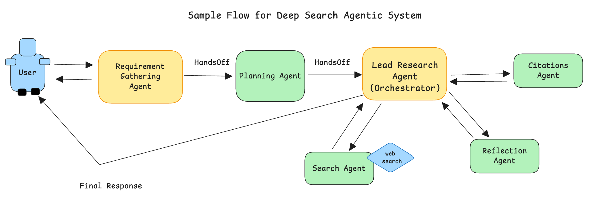

### **Assignment Guide — Build a Deep Research Agent System**

> **Goal:** Create an intelligent Deep Research Agent that can handle complex questions like a professional researcher. It will break down complex topics, search multiple sources

### **How to Build This Step by Step**

**Phase 1: Foundation** 
- Start with your basic web search agent from steps 1-10
- Make sure it works perfectly with simple questions first
- Test with: "What is renewable energy?"

**Phase 2 : Multi-Agent Team** 
- Add the multi-agent features from steps 11-14
- Start with just 2 agents, then add more
- Test with: "What are pros and cons of electric cars?"

**Phase 3: Smart Research**
- Add planning agent - breaks questions into parts
- Add parallel research - multiple searches at once  
- Test with: "Compare electric vs gas cars"

**Phase 4: Professional Features**
- Add source checking, conflict detection, synthesis
- Add citation system
- Test with complex questions like Level 3 and 4 challenges

**Pro Tips for Success:**
1. **Build Incrementally**: Don't add everything at once - test each step
2. **Start Simple**: Use basic questions first, then move to complex ones  
3. **Keep Your Foundation**: Don't break your basic search while adding features
4. **Test Real Scenarios**: Use the provided test questions to validate each phase
5. **Watch the Research Process**: Make sure you can see what each agent is doing

**Key Architecture Insight:** 
This system mimics how professional researchers work - they plan their approach, divide work among team members, check sources, look for conflicts, and synthesize findings into coherent reports. Your agents should work together like a real research team!

---

**Remember**: You're building a professional-grade research system! Start with solid foundations, add one feature at a time, and test with increasingly complex questions. Good luck creating your Deep Research Agent System!

> You'll use what you learned from **folders 01 → 14** to build this advanced multi-agent system inspired by OpenAI Deep Research, Anthropic Research, Google Deep Research, and cutting-edge academic research.

---

### Quickstart (Minimal)

- Requirements: Python 3.10+ and uv.
- Environment: create a `.env` file with keys you plan to use:
  - `SEARCH_API_KEY`
  - `TAVILY_API_KEY` (if using Tavily; default recommended)
  - `OPENAI_API_KEY` or `ANTHROPIC_API_KEY` (if using an LLM provider)
- Default search provider: Tavily by default; DuckDuckGo acceptable as fallback.

---

## **Deep Research Features Inspired by Industry Leaders**

### ↠ Research Planning – *Break Down Complex Questions*

| Why                                                        | Task                                                                                                           |
| ---------------------------------------------------------- | -------------------------------------------------------------------------------------------------------------- |
| Complex research questions need to be broken into smaller, manageable parts. | Create a Planning Agent that takes user questions like "Compare renewable energy policies in 3 countries" and breaks it into specific research tasks like "Country A energy policy", "Country B energy policy", etc. |

---

### ↠ Parallel Research – *Multiple Searches at Once*

| Why                                                        | Task                                                                                                           |
| ---------------------------------------------------------- | -------------------------------------------------------------------------------------------------------------- |
| Good researchers explore multiple angles simultaneously. | Modify your system so multiple research agents can work on different parts of the question at the same time, not one after another. |

---

### ↠ Source Quality Check – *Trust but Verify*

| Why                                                        | Task                                                                                                           |
| ---------------------------------------------------------- | -------------------------------------------------------------------------------------------------------------- |
| Not all sources are equally reliable. | Add a Source Checker agent that rates sources as High (.edu, .gov, major news), Medium (Wikipedia, industry sites), or Low (blogs, forums) and warns users about questionable information. |

---

### Conflict Detection – *Spot Disagreements*

| Why                                                        | Task                                                                                                           |
| ---------------------------------------------------------- | -------------------------------------------------------------------------------------------------------------- |
| Different sources sometimes contradict each other. | When your agents find conflicting information, highlight it clearly: "Source A says X, but Source B says Y" and let users know there's disagreement. |

---

### Research Synthesis – *Combine Everything Smart*

| Why                                                        | Task                                                                                                           |
| ---------------------------------------------------------- | -------------------------------------------------------------------------------------------------------------- |
| Raw search results need to be organized into useful insights. | Create a Synthesis Agent that takes all research findings and organizes them into clear sections with themes, trends, and key insights rather than just listing facts. |

---

### Citation Management – *Professional References*

| Why                                                        | Task                                                                                                           |
| ---------------------------------------------------------- | -------------------------------------------------------------------------------------------------------------- |
| Professional research requires proper attribution. | Add automatic citation tracking: every claim gets a numbered reference [1], [2], [3] with full source details at the end of the report. |

---

## Research Material

Remember you can build on your own ideas to complete this project. Below are some general guidelines and research material

- https://www.anthropic.com/engineering/multi-agent-research-system
- https://blog.langchain.com/open-deep-research/
- https://gemini.google/overview/deep-research/
- https://openai.com/index/introducing-deep-research/
- https://arxiv.org/abs/2506.18959

A Sample Flow for Deep Search Agentic System

---

### **Deliverables**

| Item                     | Details                                                           |
| ------------------------ | ----------------------------------------------------------------- |
| `deep_research_system.py`    | Your main Lead Researcher agent that coordinates everything                              |
| `research_agents.py`    | The specialist research agents (fact-finder, source-checker, etc.)                               |
| `planning_agent.py`    | Agent that breaks complex questions into research tasks                               |
| `synthesis_agent.py`    | Agent that combines findings into organized insights                               |
| `report_writer.py`    | Agent that creates the final professional research report                               |
| `README.md`              | • How to set up and run your system • Example research questions • What each agent does • How the team coordinates |
| **Demo Video (+15%)** | video showing your system researching a complex topic like "Pros and cons of Agentic AI at work in 2025" or "Climate change impact on agriculture"                   |

---

### **Test Your System With These Real-World Challenges**

**Level 1: Basic Research** (Start here!)
1. "What are the benefits of electric cars?" (single topic, multiple sources)

**Level 2: Comparative Analysis** 
2. "Compare the environmental impact of electric vs hybrid vs gas cars" (multiple topics, comparison needed)

**Level 3: Complex Investigation** 
3. "How has artificial intelligence changed healthcare from 2020 to 2024, including both benefits and concerns from medical professionals?" (time-based analysis, multiple perspectives, conflict detection)

**Level 4: Expert Challenge** 
4. "Analyze the economic impact of remote work policies on small businesses vs large corporations, including productivity data and employee satisfaction trends" (multi-dimensional analysis, data synthesis, professional-level research)

## How to use Steps to Guide your Progress?

### 1 ↠ 01_uv – *Project setup*

| Why it matters                                                          | What you must do                                                                                            |
| ----------------------------------------------------------------------- | ----------------------------------------------------------------------------------------------------------- |
| `uv` lets you install & run dependencies fast without global pollution. | • Clone the repo • Verify you can run a “Hello, Agent” script. |

---

### 2 ↠ 02_what_is_api – *Talking to the outside world*

| Why                                                                  | Task                                                                                                                      |
| -------------------------------------------------------------------- | ------------------------------------------------------------------------------------------------------------------------- |
| A web-search agent is basically an **API client** wrapped in an LLM. | Pick a search API (Bing, Google CustomSearch, DuckDuckGo, etc.). Read its docs, note required query params & auth header. | You can use tavily for web-search

---

### 3 ↠ 03_get_api_key – *Security 101*

| Why                                                               | Task                                                                                     |
| ----------------------------------------------------------------- | ---------------------------------------------------------------------------------------- |
| Never hard-code keys. You’ll break security and rate-limit rules. | • Create `.env` with `SEARCH_API_KEY=...` • Load it via `os.getenv` inside your tool. |

---

### 4 ↠ 04_hello_agent – *Your first runnable agent*

| Why                                                                   | Task                                                                                                                  |
| --------------------------------------------------------------------- | --------------------------------------------------------------------------------------------------------------------- |
| Gives you a minimal skeleton: model + Agent + run cycle. | Copy `hello_agent.py` → `web_search_agent.py`. Replace greeting logic with a placeholder “search API called” message or with proper system prompt. |

---

### 5 ↠ 05_model_configuration – *Tuning the brain*

| Why                                                                  | Task                                                                                              |
| -------------------------------------------------------------------- | ------------------------------------------------------------------------------------------------- |
| Temperature, max-tokens, model choice dictate response style & cost. | • Set `temperature=xxx` (experiment with temp and select your desire temperature). • Limit `max_tokens` so summaries stay crisp. |

---

### 6 ↠ 06_basic_tools – *Giving the agent ToolBox*

| Why                                               | Task                                                                                                                                        |
| ------------------------------------------------- | ------------------------------------------------------------------------------------------------------------------------------------------- |
| Tools let the LLM reach beyond its training data. | Implement a `search_web` tool that: 1. Accepts `{query:str}` 2. Calls chosen API 3. Returns top N results (title + URL + snippet). |

---

### 7 ↠ 07_model_settings – *Refining behaviour*

| Why                                                              | Task                                                                                                  |
| ---------------------------------------------------------------- | ----------------------------------------------------------------------------------------------------- |
| You can pin the model to summarise, cite, or reason differently. | Add an instruction like: “When responding, give a **three-sentence answer** with bullet-point links.” |

---

### 8 ↠ 08_local_context – *Personalisation layer*  **⬅ NEW FOCUS**

| Why                                                                                                                                                                          | Task                                                                                                                                                                                                                                                                                                 |
| ---------------------------------------------------------------------------------------------------------------------------------------------------------------------------- | ---------------------------------------------------------------------------------------------------------------------------------------------------------------------------------------------------------------------------------------------------------------------------------------------------- |
| **Local context** lets the agent remember rich user-specific data between turns. We’ll use it to **fetch user-profile info** and tailor answers. | • During the first user turn, store a `user_profile` object in `context` (you can fake it or read from a mock DB). • Each subsequent turn, prepend dynamic instructions such as:   “You’re helping **{name}** from **{city}** who likes **{topic}.** Personalise examples accordingly.” |

---

### 9 ↠ 09_dynamic_instructions – *Adapting on the fly*

| Why                                                                                                  | Task                                                                                                                     |
| ---------------------------------------------------------------------------------------------------- | ------------------------------------------------------------------------------------------------------------------------ |
| Users say “search deeper” or “give me just links.” | • Detect keywords like “deeper” / “summarise” or understand user query what user asked for. • Mutate instructions (e.g., increase result count or shorten answer). |

---

### 10 ↠ 10_streaming – *Real-time UX bonus*

| Why                                                        | Task                                                                                                           |
| ---------------------------------------------------------- | -------------------------------------------------------------------------------------------------------------- |
| Streaming partial replies feels faster and shows progress. | Use the SDK’s streaming wrapper so results trickle to the console as soon as they arrive. |

### 11 ↠ 11_agent_clone – *Research Team Creation*

| Why                                                        | Task                                                                                                           |
| ---------------------------------------------------------- | -------------------------------------------------------------------------------------------------------------- |
| Complex research needs a team of specialists working together. | Create a "Research Team" with different agent roles: one for finding facts, one for checking sources, and one for writing summaries. |

---

### 12 ↠ 12_basic_tracing – *Track Research Progress*

| Why                                                        | Task                                                                                                           |
| ---------------------------------------------------------- | -------------------------------------------------------------------------------------------------------------- |
| You need to see what each research agent discovered. | Add a simple logging system so you can see which agent found what information and track the research process. |

---

### 13 ↠ 13_agents_as_tool – *Research Coordinator*

| Why                                                        | Task                                                                                                           |
| ---------------------------------------------------------- | -------------------------------------------------------------------------------------------------------------- |
| One "lead researcher" should manage the whole team. | Create a Lead Researcher agent that breaks complex questions into smaller research tasks and assigns them to specialist agents. |

---

### 14 ↠ 14_basic_handoffs – *Information Sharing*

| Why                                                        | Task                                                                                                           |
| ---------------------------------------------------------- | -------------------------------------------------------------------------------------------------------------- |
| Research agents need to share findings with each other. | Set up handoffs so agents can pass their discoveries to a "Report Writer" agent that combines everything into a final research report. |

---

### **Marking Rubric (150 pts)**

**Foundation Skills (60 pts) - From Folders 1-10**
| What We Check                           | Points |
| ----------------------------------- | --- |
| Environment setup and API security | 10   |
| Basic search functionality             | 15  |
| Model configuration and prompting          | 10  |
| Local context and personalization       | 15  |
| Streaming and dynamic instructions | 10  |

**Multi-Agent Coordination (50 pts) - From Folders 11-14**  
| What We Check                           | Points |
| ----------------------------------- | --- |
| Multiple agents created and working | 15   |
| Agent tracing and monitoring             | 10  |
| Lead coordinator managing team well          | 15  |
| Proper handoffs between agents       | 10  |

**Deep Research Features (40 pts) - Industry-Inspired**
| Advanced Feature                           | Points |
| ----------------------------------- | --- |
| Research planning (breaks down complex questions) | 10   |
| Parallel research execution             | 10  |
| Source quality assessment         | 10  |
| Conflict detection and synthesis | 10  |

**Bonus Features (up to +30)**
- Professional citation system: +10
- Advanced conflict resolution: +10  
- Creative research strategies: +5
- Excellent error handling: +5

---

### **Hints**

1. **Mock user data**: If you don’t have a real user DB, create a simple `user_profile = {"name":"Ali","city":"Lahore","topic":"AI"}` and store it on first run.
2. **Rate-limits**(Optional): Search APIs often cap requests—cache results in local context to avoid repeat calls.
3. **Testing** (Optional): Write a few unit tests for the tool function to ensure it gracefully handles empty results or API errors.

---

**Challenge yourself, have fun, and remember — a personalised answer is always more valuable than a generic one. Good luck building your Web Search Agent!**
