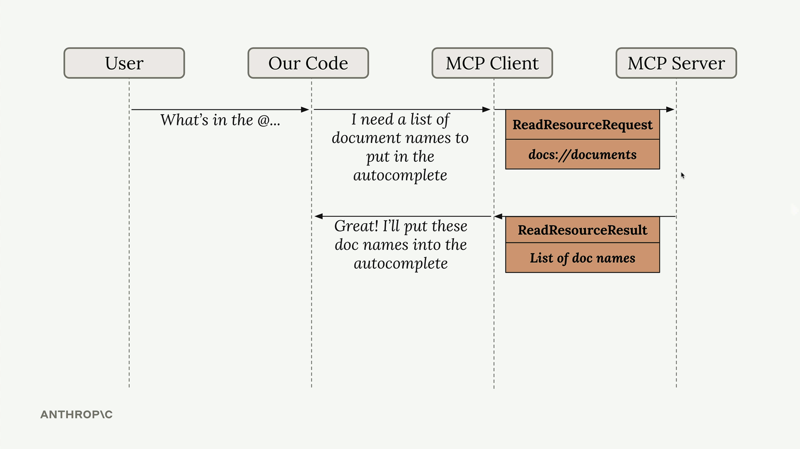

# 05. Working with Resources

Resources in MCP servers allow you to expose data to clients, similar to GET request handlers in a typical HTTP server. They're perfect for scenarios where you need to fetch information rather than perform actions.


### 🏗️ MCP Resources vs. What You Know

| **If you're familiar with...** | **MCP Resources are like...** | **Key advantage** |
|-------------------------------|--------------------------------|-------------------|
| **File Systems** | Files the AI can browse and read | Discoverable and structured for AI |
| **REST API GET endpoints** | Read-only API endpoints | Built-in metadata and categorization |
| **RAG (Retrieval Augmented Generation)** | Knowledge base for AI context | Standardized across all AI platforms |
| **Documentation Sites** | Docs the AI can navigate | Self-describing with rich metadata |
| **Database Views** | Queryable data collections | AI-friendly formatting and discovery |

### Key Characteristics of Resources

- **Read-only**: Resources provide data, not actions
- **URI-based**: Accessed through specific URIs with optional parameters
- **MIME-typed**: Support various content types (JSON, text, images, etc.)
- **App-controlled**: The application decides when to expose resources
- **Static or templated**: Can be direct resources or parameterized

## How Resources Work?

Resources follow a request-response pattern. When your client needs data, it sends a ReadResourceRequest with a URI to identify which resource it wants. The MCP server processes this request and returns the data in a ReadResourceResult.



Resources can return any type of data - strings, JSON, binary data, etc. Use the mime_type parameter to give clients a hint about what kind of data you're returning:

"application/json" for structured data
"text/plain" for plain text
"application/pdf" for binary files
The MCP Python SDK automatically serializes your return values. You don't need to manually convert objects to JSON strings - just return the data structure and let the SDK handle serialization.


## Types of Resources

There are two types of resources:

### 1. Direct Resources
Direct resources have static URIs that never change. They're perfect for operations that don't need parameters.

### 2. Templated Resources
Templated resources include parameters in their URIs. The Python SDK automatically parses these parameters and passes them as keyword arguments to your function.

## Update your server to add Resources

Let's update our project server for resources and access patterns.

### 1. Write a resource to return all doc id's

Update `mcp_server.py`:


```python
@mcp.resource(
    "docs://documents",
    mime_type="application/json"
)
def list_docs() -> list[str]:
    return list(docs.keys())
```

### 2. Write a resource to return the contents of a particular doc

```python
@mcp.resource(
    "docs://{doc_id}",
    mime_type="text/plain"
)
def get_doc(doc_id: str) -> str:
    return docs[doc_id]
```

## Implementing Resource Reading From MCP Client

To enable resource access in your MCP client, you need to implement a read_resource function. 

In mcp_client.py first, add the necessary imports:

```python
import json
from pydantic import AnyUrl
```

The core function makes a request to the MCP server and processes the response based on its MIME type:

```python
async def read_resource(self, uri: str) -> Any:
    result = await self.session().read_resource(AnyUrl(uri))
    resource = result.contents[0]
    
    if isinstance(resource, types.TextResourceContents):
        if resource.mimeType == "application/json":
            return json.loads(resource.text)
    
    return resource.text
```

## Testing Resource Access

Once implemented, you can test the resource functionality through your:
1. Start MCP Inspector to verify server resources are correctly implemented.
2. Use Postman collection to understand resources in more detail.
3. Use CLI application. When you type "@" followed by a resource name, the system will:
   - Show available resources in an autocomplete list.
   - Let you select a resource using arrow keys and space.
   - Include the resource content directly in your prompt.
   - Send everything to the AI model without requiring additional tool calls.
4. Additionally, use the new Postman requests "List Documents Resource" and "Get Document Content" to directly verify the resource endpoints.

This creates a much smoother user experience compared to having the AI model make separate tool calls to access document contents. 

## Resources

- [MCP Resource Specification](https://modelcontextprotocol.io/specification/2025-06-18#resources)
- [MIME Types Reference](https://developer.mozilla.org/en-US/docs/Web/HTTP/Basics_of_HTTP/MIME_types)
- [URI Design Best Practices](https://tools.ietf.org/html/rfc3986) 