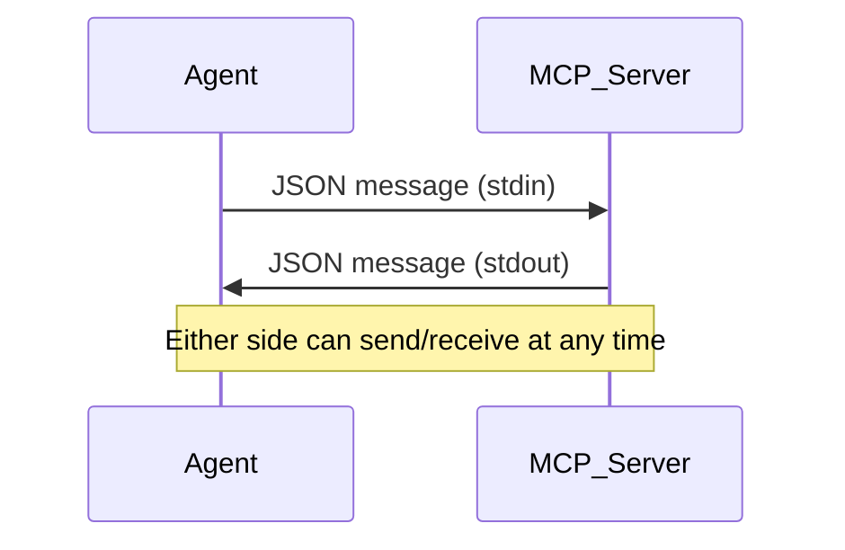

# MCP Transports: How Agents and Servers Really Talk

---

## 🌱 Curiosity Kickoff

> **Why do some agent features (like progress bars or logging) work perfectly on your laptop, but break when you deploy to the cloud? What’s really happening “on the wire” between your agent and the server?**

---

## 🚦 What Is a Transport?

A **transport** is the “channel” that carries MCP messages between your agent and the tool server.  
Your choice of transport determines:
- **Which features work** (progress, logging, notifications, etc.)
- **How scalable your system is**
- **How easy it is to debug and develop**

---

## 🚂 The STDIO Transport

- **How it works:**  
  - The agent launches the MCP server as a subprocess.
  - They communicate using standard input/output (stdin/stdout).
  - Either side can send a message at any time—full bidirectionality!
- **Why it’s great:**  
  - Perfect for local development and testing.
  - All MCP features work: progress bars, logging, notifications, server-initiated requests, etc.
- **Limitations:**  
  - Only works when agent and server are on the same machine.
  - Not suitable for cloud or distributed deployments.


  > *If the server needs to send a progress update, it just writes to stdout and the agent reads it immediately.*

**🧠 Active Prompt:**  
*Why do you think full bidirectionality is so easy with STDIO? What might be a challenge if you want to run your server in the cloud?*

---

## 🌐 The StreamableHTTP Transport

- **Why it’s needed:**  
  - Lets agents connect to remote/public MCP servers over HTTP.
  - Enables cloud and distributed deployments.
- **The challenge:**  
  - HTTP is designed for clients to make requests to servers—not the other way around.
  - Server-initiated messages (like progress updates) are hard to do with plain HTTP.
- **The solution:**  
  - **Server-Sent Events (SSE):**  
    - The client opens a long-lived HTTP connection (SSE).
    - The server can now “push” messages (progress, logging, etc.) back to the client.
  - **Dual connections:**  
    - One SSE connection for general server-to-client messages.
    - Additional SSE connections for each tool call.

```mermaid
graph TD
    Agent -- POST/GET -->|Requests| MCP_Server
    Agent -- SSE -->|Persistent connection| MCP_Server
    MCP_Server -- "Push: progress/logging" --> Agent
    Note right of MCP_Server: SSE lets server send messages anytime
```
 
- **SSE connection** is like a “radio channel” the server can use to broadcast updates.
- Example:  
  > *When you call a tool, the server can stream progress and logs back to you in real time via SSE.*
  
**🧠 Active Prompt:**  
*How does SSE help the server “cheat” and send messages to the client, even though HTTP is usually one-way?*

---

### Stateless StreamableHTTP (Scaling with stateless_http)

```mermaid
flowchart LR
    subgraph Cloud
        LB(Load Balancer)
        S1(Server 1)
        S2(Server 2)
    end
    Agent -- POST/GET --> LB
    LB -- routes --> S1
    LB -- routes --> S2
    S1 -.->|No session| S2
    Note right of S2: stateless_http = no session, no progress, no server-initiated
```

- With stateless HTTP, each request could go to a different server, so there’s no way to keep track of sessions or stream updates.

> For a hands-on look at what actually breaks with stateless HTTP, see the next step.

---

## ⚙️ Configuration Flags & Scaling

- **stateless_http:**  
  - Needed for horizontal scaling (multiple servers behind a load balancer).
  - **Trade-off:** You lose session state, progress updates, server-initiated requests, and more.
- **json_response:**  
  - Disables streaming for POST responses—only the final result is sent, no intermediate updates.
  - **Use case:** Useful for simple integrations or when you only care about the final result and want to avoid streaming complexity.
- **What breaks when you enable these?**  
  - No progress bars, no logging, no server-initiated requests, no sampling, no subscriptions.

**🧠 Active Prompt:**  
*If you need to scale to thousands of clients, what would you lose by enabling stateless HTTP? When might that be worth it?*

---

## 🚦 When to Use Each Transport (Quick Comparison)

| Transport         | Best For                | Features Supported         | Limitations/Trade-offs         |
|-------------------|------------------------|----------------------------|-------------------------------|
| STDIO             | Local dev, testing      | All MCP features           | Not for distributed/cloud     |
| StreamableHTTP    | Cloud, remote, prod     | All (if stateful)          | Needs SSE, more complex       |
| Stateless HTTP    | Large-scale, load bal.  | Only basic tool calls      | No progress, no sessions      |

---

## 🏁 Key Takeaways

- **STDIO** is ideal for local development and full-featured MCP, but not for distributed/cloud.
- **StreamableHTTP** enables cloud deployments, but you must understand its workarounds and trade-offs.
- **Your transport choice is a design decision**—it shapes what your agent can do and how it scales.
- **Always test with your intended production transport!**

---

## ✍️ Student Reflection

> **In your own words:**  
> Why might you choose StreamableHTTP over STDIO, and what would you lose or gain by doing so?

---

## 🧩 Active Learning Questions

1. **Scenario:**  
   You want to deploy your agent to the cloud and support thousands of users. Which transport and settings would you use? What features might break?
2. **Fill in the blank:**  
   The main reason you might enable `stateless_http` is to ________, but you lose ________.
3. **Short answer:**  
   How does SSE enable server-to-client communication over HTTP?

---

**Ready for hands-on?**  
Move to the next step to see how a real MCP connection lifecycle works in practice—and what happens when you switch between stateful and stateless HTTP!

➡️ [Go to: Stateful HTTP Lifecycle →](../02_stateful_http_lifecycle/README.md)