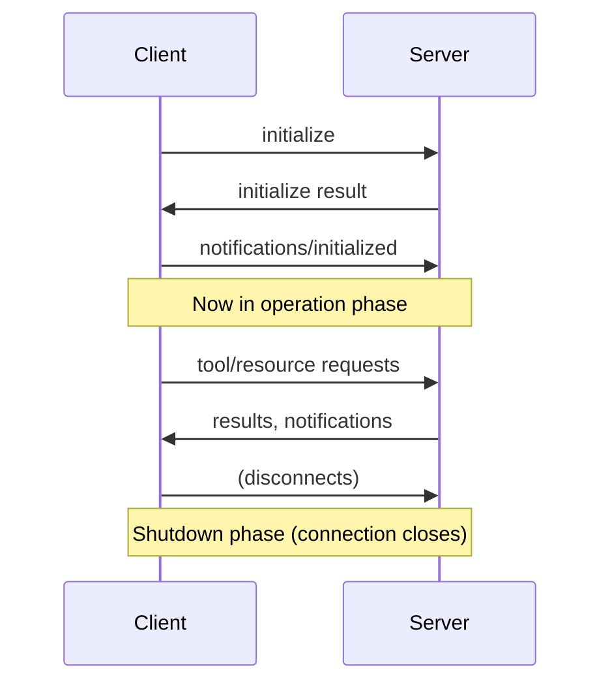

# State and the StreamableHTTP transport Lifecycle (2025-06-18)

> **If you haven't reviewed the transport trade-offs, see the previous step: [MCP Transports](../01_mcp_transports/readme.md)**

The stateless_http and json_response flags in MCP servers control fundamental aspects of how your server behaves. Understanding when and why to use them is crucial, especially if you're planning to scale your server or deploy it in production

## When You Need Stateless HTTP
Imagine you build an MCP server that becomes popular. Initially, you might have just a few clients connecting to a single server instance:

As your server grows, you might have thousands of clients trying to connect. Running a single server instance won't scale to handle all that traffic:

The typical solution is horizontal scaling - running multiple server instances behind a load balancer:

But here's where things get complicated. Remember that MCP clients need two separate connections:

1. A GET SSE connection for receiving server-to-client requests
2. POST requests for calling tools and receiving responses

With a load balancer, these requests might get routed to different server instances. If your tool needs to use Claude (through sampling), the server handling the POST request would need to coordinate with the server handling the GET SSE connection. This creates a complex coordination problem between servers.

## How Stateless HTTP Solves This
Setting stateless_http=True eliminates this coordination problem, but with significant trade-offs:

When stateless HTTP is enabled:

- Clients don't get session IDs - the server can't track individual clients
- No server-to-client requests - the GET SSE pathway becomes unavailable
- No sampling - can't use Claude or other AI models
- No progress reports - can't send progress updates during long operations
- No subscriptions - can't notify clients about resource updates

However, there's one benefit: client initialization is no longer required. Clients can make requests directly without the initial handshake process.

## When to Use These Flags
Use stateless HTTP when:
- You need horizontal scaling with load balancers
- You don't need server-to-client communication
- Your tools don't require AI model sampling
- You want to minimize connection overhead

Use JSON response when:
- You don't need streaming responses
- You prefer simpler, non-streaming HTTP responses
- You're integrating with systems that expect plain JSON

### 🤔 What Is the Stateful HTTP MCP Connection Lifecycle? (Simple Explanation)

**Simple Definition**: The MCP Connection Lifecycle is the **conversation protocol** that AI and servers use to connect, negotiate capabilities, communicate, and disconnect.

**Real-World Analogy**: Think of it like meeting a new person:
1. 🤝 **Introduction (Initialization)**: "Hi, I'm Claude. I can do X, Y, Z. What can you do?"
2. 🗣️ **Conversation (Operation)**: Normal back-and-forth communication using agreed capabilities
3. 👋 **Goodbye (Shutdown)**: "Thanks for the chat, see you later!"

---

### 📋 The Three Essential Phases

#### **Phase 1: Initialization (The Handshake)**
- 🤝 **Negotiate protocol versions**: Ensure compatibility
- 📋 **Exchange capabilities**: "I can do X, you can do Y"
- 🆔 **Share identity information**: Names, versions, descriptions
- ✅ **Confirm readiness**: Both sides ready for normal operation

#### **Phase 2: Operation (The Conversation)**
- 🔧 **Call tools** using negotiated capabilities
- 📚 **Read resources** that were discovered
- 💬 **Use prompts** that are available
- 🔄 **Handle errors** gracefully

#### **Phase 3: Shutdown (The Goodbye)**
- 🧹 **Clean up resources** and connections
- 💾 **Save state** if needed
- 👋 **Graceful disconnection** without data loss

---

### 🗺️ Lifecycle Sequence Diagram



This lesson demonstrates the three-phase MCP lifecycle: **Initialization → Operation → Shutdown** according to the official [MCP 2025-06-18 Lifecycle specification](https://modelcontextprotocol.io/specification/2025-06-18/basic/lifecycle).

## Key MCP Concepts (2025-06-18)

### 🎯 **Lifecycle Phases**
1. **Initialization**: Protocol version agreement and capability negotiation
2. **Operation**: Normal protocol communication using negotiated capabilities  
3. **Shutdown**: Graceful connection termination

### 📊 **Core Requirements**
- **Protocol Version**: Use `"2025-06-18"` in JSON requests (per official spec)
- **HTTP Headers**: Include `MCP-Protocol-Version: 2025-06-18` after initialization
- **Session Management**: Server handles sessions automatically in stateful mode
- **Error Handling**: Proper JSON-RPC 2.0 error responses

## 🔧 Official 2025-06-18 Implementation

### **Phase 1: Initialization**

**Client Initialize Request:**
```json
{
    "jsonrpc": "2.0",
    "id": 1,
    "method": "initialize",
    "params": {
        "protocolVersion": "2025-06-18",
        "capabilities": {
            "roots": {
                "listChanged": true
            },
            "sampling": {},
            "elicitation": {}
        },
        "clientInfo": {
            "name": "ExampleClient",
            "title": "Example Client Display Name",
            "version": "1.0.0"
        }
    }
}
```

**Server Initialize Response:**
```json
{
    "jsonrpc": "2.0",
    "id": 1,
    "result": {
        "protocolVersion": "2025-06-18",
        "capabilities": {
            "logging": {},
            "prompts": {
                "listChanged": true
            },
            "resources": {
                "subscribe": true,
                "listChanged": true
            },
            "tools": {
                "listChanged": true
            },
            "completions": {}
        },
        "serverInfo": {
            "name": "ExampleServer",
            "title": "Example Server Display Name",
            "version": "1.0.0"
        },
        "instructions": "Optional instructions for the client"
    }
}
```

**Client Initialized Notification:**
```json
{
    "jsonrpc": "2.0",
    "method": "notifications/initialized"
}
```

### **Phase 2: Operation**

After initialization, the client **MUST** include the `MCP-Protocol-Version` header:

```http
POST /mcp/ HTTP/1.1
Content-Type: application/json
MCP-Protocol-Version: 2025-06-18
mcp-session-id: <session-id>

{
    "jsonrpc": "2.0",
    "method": "tools/list",
    "params": {},
    "id": 2
}
```

### **Phase 3: Shutdown**

Per the specification:
- **No specific shutdown messages are defined**
- **HTTP transport**: Shutdown by closing the HTTP connection
- Session cleanup happens automatically

## 🚀 Quick Start

**What FastMCP Automatically Handles:**

> **FastMCP automates all the hard parts for you:**
> - ✅ Protocol version negotiation (`2025-06-18` ↔ `2025-06-18`)
> - ✅ HTTP header requirements (`MCP-Protocol-Version`)
> - ✅ Session management (stateful mode)
> - ✅ Capability negotiation
> - ✅ JSON-RPC 2.0 compliance
> - ✅ Error handling
> - ✅ Graceful shutdown

### **Terminal 1: Start the Enhanced Server**
```bash
uv add mcp uvicorn httpx
uv run uvicorn server:mcp_app --host 0.0.0.0 --port 8000 --reload
```

### **Terminal 2: Test with Client**
```bash
uv run python client.py
```

## Key Learning Outcomes

### **✅ Lifecycle Management**
- Understanding the three mandatory phases
- Protocol version negotiation between JSON and HTTP headers
- Capability exchange and validation
- Proper session handling

### **✅ 2025-06-18 Compliance**
- Using correct protocol versions (`"2025-06-18"` in JSON)
- Required HTTP headers (`MCP-Protocol-Version: 2025-06-18`)
- Enhanced capability structure with `title` fields
- Proper error handling patterns

### **✅ FastMCP Benefits**
- Automatic lifecycle management
- Built-in 2025-06-18 compliance
- Simplified development experience
- Production-ready error handling

---

## 🔍 What You Lose with stateless_http

- ❌ No session IDs (no per-client state)
- ❌ No server-to-client requests (no SSE pathway)
- ❌ No sampling (can't use Claude or other AI models)
- ❌ No progress reports (no streaming updates)
- ❌ No subscriptions (no resource update notifications)
- ✅ But: No initialization required, and you can scale horizontally with load balancers

---

## References

- [MCP 2025-06-18 Lifecycle](https://modelcontextprotocol.io/specification/2025-06-18/basic/lifecycle)
- [HTTP Transport Requirements](https://modelcontextprotocol.io/specification/2025-06-18/basic/transports#protocol-version-header)
- [JSON-RPC 2.0 Specification](https://www.jsonrpc.org/specification)

This lesson shows how FastMCP makes implementing the complete MCP 2025-06-18 lifecycle specification straightforward and reliable.