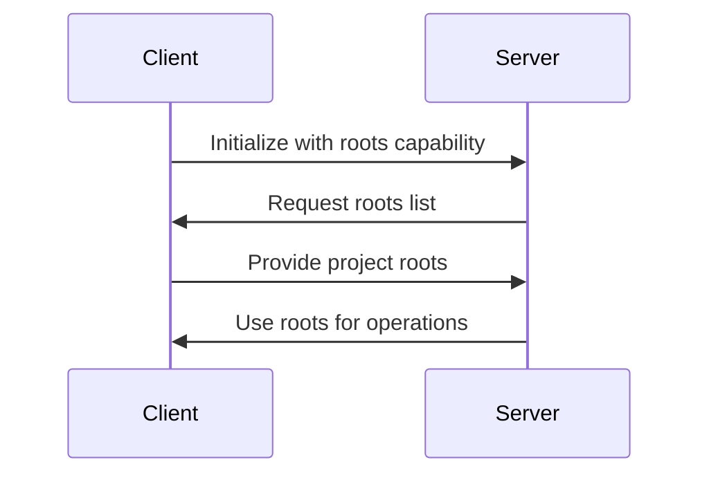

# 03: Project Context Discovery with [MCP Roots](https://modelcontextprotocol.io/specification/2025-06-18/client/roots)

## 🎯 Learning Objectives
By the end of this lesson, you will be able to:
1. **Understand** the importance of project context in development tools
2. **Explain** how MCP roots enable contextual awareness
3. **Implement** basic roots capability in MCP clients
4. **Use** roots in MCP servers for project analysis
5. **Apply** best practices for secure root handling

## ⚠️ Known Issues
There appears to be a bug in the MCP Python SDK (as of version 1.10.1) where the roots/list request gets stuck during communication between client and server. This has been observed when:
1. The client successfully initializes with roots capability
2. The server requests roots via `ctx.session.list_roots()`
3. The communication hangs without completing the request

We are tracking this issue and will update the example once it's resolved. For now, this serves as a demonstration of the roots concept and API usage.

## 📚 Core Concept: Project Context Awareness

### The Problem
Development tools often need to understand the project structure they're working with:
- Which files belong to the project?
- Where are source files located?
- What are the project boundaries?

Traditionally, this required manual configuration:
```python
project_dir = "/path/to/project"  # Hardcoded or configured
analyze_code(f"{project_dir}/src/main.py")
```

### The Solution: MCP Roots
MCP Roots provides automatic project context discovery:
1. Clients (IDEs, editors) expose project directories
2. Servers (tools, analyzers) request access as needed
3. No manual configuration required

```python
# Server just requests roots and gets project context
roots = await ctx.session.list_roots()
project_files = roots.roots[0].list_files("**/*.py")
```

## 🛠️ Implementation

### Client Side
The client needs to:
1. Implement the roots capability
2. Handle roots/list requests
3. Provide project directory information

See `client.py` for a basic implementation.

### Server Side
The server can:
1. Request project roots from client
2. Use roots to analyze project structure
3. Work with files in project context

See `server.py` for a basic implementation.

## 🎯 Practice Exercises
1. Modify the client to expose multiple project roots
2. Add file type filtering to the server analysis
3. Implement recursive directory scanning
4. Add project feature detection (README, git, etc.)

## 📚 Further Reading
- [MCP Roots Specification](https://modelcontextprotocol.io/specification/2025-06-18/client/roots)
- [Project Context in Development Tools](https://modelcontextprotocol.io/blog/project-context)
- [Best Practices for Root Handling](https://modelcontextprotocol.io/blog/root-handling)

## 🔍 Key Concepts

### 1. Project Roots
- **Definition**: Directories that form the boundaries of a project
- **Examples**: 
  - Workspace folders in VS Code
  - Project directories in PyCharm
  - Git repository root directories

### 2. URI Representation
```python
# Example root structure
{
    "uri": "file:///home/user/projects/myapp",
    "name": "MyApp Project"
}
```

### 3. Client-Server Flow


## 💻 Hands-On Implementation

### Step 1: Setup Project
```bash
cd mcp_code
uv sync
```

### Step 2: Run the Demo
Terminal 1:
```bash
uv run uvicorn server:mcp_app --reload
```

Terminal 2:
   ```bash
   uv run python client.py
   ```

### Step 3: Observe the Output
You'll see:
1. Client initialization with roots capability
2. Server requesting project roots
3. Project analysis results showing:
   - File counts by type
   - Project features detection
   - Basic structure analysis

## 🛠️ Code Walkthrough

### Client Implementation
```python
class RootsCapableClient:
    def __init__(self):
        self.project_roots = [{
            "uri": Path.cwd().as_uri(),
            "name": "Current Project"
        }]

    async def handle_roots_list(self, context, params):
        return {"roots": self.project_roots}
```

**Key Points:**
- Simple root declaration
- URI-based path representation
- Basic project detection

### Server Implementation
```python
@mcp.tool()
async def analyze_project(ctx: Context) -> str:
    roots_response = await ctx.roots.list()
    # Process each root directory
    for root in roots_response.roots:
        # Analyze project structure
```

**Key Points:**
- Root list request
- Project structure analysis
- Error handling


## 🔒 Security Best Practices

1. **Path Validation**
   ```python
   # Always validate paths
   if not is_path_within_root(file_path, root_path):
       raise SecurityError("Path traversal attempt")
   ```

2. **Permission Checking**
   ```python
   # Check access permissions
   if not has_read_permission(root_path):
       raise PermissionError("Cannot access root")
```

## 📈 Real-World Applications

1. **IDE Integration**
   - Project-wide search and replace
   - Dependency analysis
   - Code generation

2. **Development Tools**
   - Linting entire projects
   - Documentation generation
   - Test coverage analysis

3. **Build Tools**
   - Project structure validation
   - Resource compilation
   - Deployment preparation

4. **Integration Ideas**
   - Combine with sampling for AI-powered analysis
   - Use with elicitation for interactive project setup
   - Build project-aware development tools

## 📚 Additional Resources

1. [MCP Roots Specification](https://modelcontextprotocol.io/specification/2025-06-18/client/roots)
2. [Project Context Best Practices](https://12factor.net/)

---

Remember: The power of MCP roots lies in enabling tools to understand and work with project context automatically, making development more efficient and context-aware. 