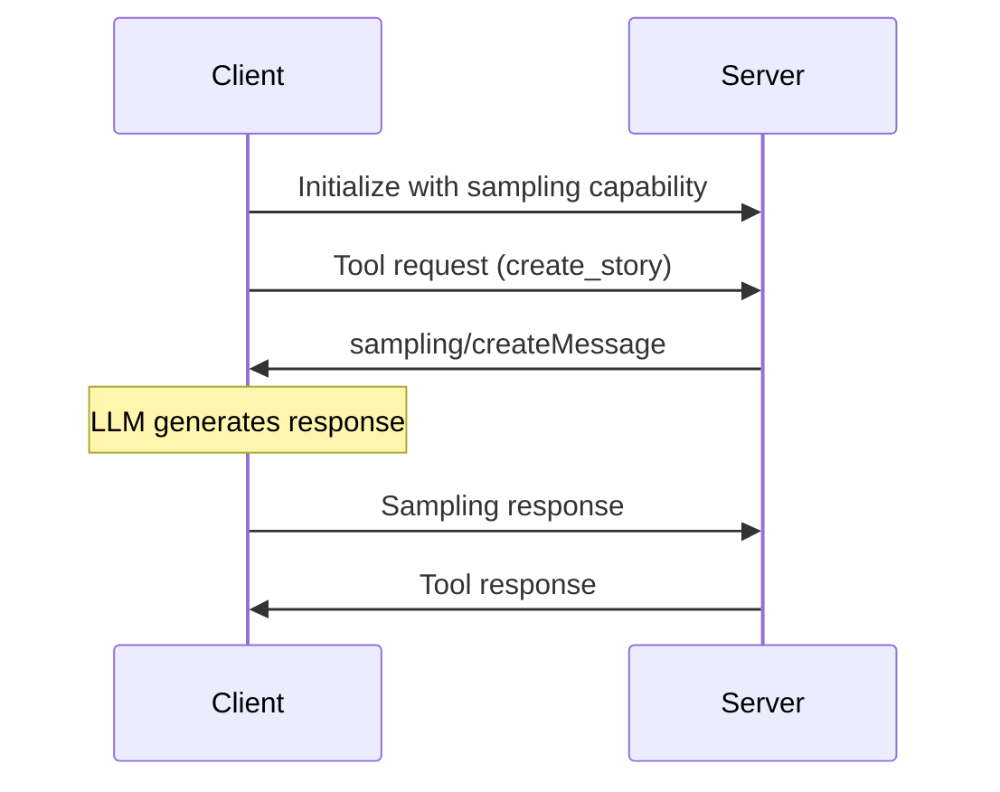

# [Sampling](https://modelcontextprotocol.io/specification/2025-06-18/client/sampling) - Giving Tools a Brain

Why might a server want to ask a client to 'think' for it, instead of just doing everything itself?"

> Sampling lets MCP servers delegate creative or complex reasoning to the client’s LLM, shifting cost and control. This enables tools that are more flexible, adaptive, and powerful. For example, instead of hardcoding a story generator, the server can ask the client’s LLM to write a story on demand. This requires stateful, bidirectional communication (StreamableHTTP).

## How Sampling Works
The flow is straightforward:
- Server completes its work (like fetching Wikipedia articles)
- Server creates a prompt asking for text generation
- Server sends a sampling request to the client
- Client calls Claude with the provided prompt
- Client returns the generated text to the server
- Server uses the generated text in its response

## 🧠 Core Challenge: When Should Tools "Think"?

**Scenario:** You're building a content generation tool. You have two options:

**Option A: Let server call the llm-api**
```python
def create_story(topic: str) -> str:
    story_generated = f"Once upon a time, there was a {topic}. The end." # output of an llm call
    return story_generated
```

**Option B: AI-Powered Logic on Client Side**
```python
async def create_story(ctx: Context, topic: str) -> str:
    # Ask the client's LLM to generate creative content
    prompt = f"Write a creative story about: {topic}"
    result = await ctx.sampling.create(messages=[...])
    return result.content
```

This flow allows clients to maintain control over model access, selection, and permissions while enabling servers to leverage AI capabilities—with no server API keys necessary.

### The Power of Delegation

**Sampling** represents a fundamental shift in tool design:

- **Traditional Tools:** Server contains all the logic and intelligence
- **Sampling-Enabled Tools:** Server defines the process, client provides the intelligence
- **Result:** Tools that can adapt, reason, and produce sophisticated outputs

### Key MCP Concepts Illustrated

- **`sampling/create` (Request):** Server-to-client request for LLM inference
- **Agentic Tools:** Tools that use AI reasoning as part of their workflow
- **Stateful Connections:** Required for server-to-client communication
- **Capability Negotiation:** Client declares sampling support during initialization

## 🔑 Key MCP Sampling Concepts

### Message Flow


## When to Use Sampling

Sampling is most valuable when building publicly accessible MCP servers. You don't want random users generating unlimited text at your expense. By using sampling, each client pays for their own AI usage while still benefiting from your server's functionality.

The technique essentially moves the AI integration complexity from your server to the client, which often already has the necessary connections and credentials in place.

### Capability Declaration
```python
# Client declares sampling support
capabilities = ClientCapabilities(
    sampling=SamplingCapability(
        models=["openai/gpt-4o-mini"]  # Supported models
    )
)
```

### Message Structure
```python
# Server sampling request
result = await ctx.session.create_message(
    messages=[
        SamplingMessage(
            role="user",
            content=TextContent(
                type="text", 
                text="Write a story about..."
            )
        )
    ],
    max_tokens=100
)
```

## 🏗️ Architecture Deep Dive

### Why Stateful HTTP?

**Traditional HTTP (Stateless):**
```
Client → Tool Request → Server
Client ← Tool Response ← Server
```

**Sampling HTTP (Stateful):**
```
Client → Tool Request → Server
Client ← Sampling Request ← Server  (Server asks client to think)
Client → Sampling Response → Server
Client ← Tool Response ← Server
```

**Key Point:** Sampling requires **bidirectional communication**. The server must be able to send requests back to the client, which requires maintaining connection state.

## 📋 Hands-On Exercise: Build Your Own Sampling Tool

### Step 1: Analyze the Given Implementation

**🔍 Exploration Task:**
1. Open `mcp_code/server.py`
2. Find the `create_story` tool
3. Identify where `ctx.sampling.create()` is called
4. Trace how the prompt is constructed

**💭 Reflection Questions:**
- Why does the server construct the prompt instead of just passing the topic?
- What would happen if `stateless_http=True`?
- How does the server handle sampling failures?

### Step 2: Extend the Implementation

**🛠️ Coding Challenge:**
Add a new tool called `analyze_sentiment` that:
1. Takes a text input
2. Uses sampling to analyze the sentiment
3. Returns both sentiment and confidence level

**Starter Code:**
```python
@mcp.tool()
async def analyze_sentiment(ctx: Context, text: str) -> str:
    # TODO: Construct appropriate prompt for sentiment analysis
    # TODO: Use ctx.sampling.create() to get AI analysis
    # TODO: Parse and return structured results
    pass
```

### Step 3: Test Your Understanding

**🧪 Experiment:**
1. Run the client with different story topics
2. Observe how the AI generates different stories each time
3. Try modifying the prompt to change the story style

**📊 Questions to Explore:**
- How does prompt engineering affect output quality?
- What happens when the client's sampler fails?
- How could you add validation to the sampling results?

## 🚀 Running the Demo

### Prerequisites
```bash
cd 01_sampling/mcp_code
uv sync
```

### Execution Steps

1. **Start with the Client:**
   ```bash
   uv run python client.py
   ```

2. **Observe the Flow:**
   - Client declares sampling capability
   - Client calls `create_story` tool
   - Server receives request and uses sampling
   - Client's sampler function is invoked
   - Story flows back through the chain

3. **Expected Output:**
   ```
   🎯 MCP Sampling Client - 2025-06-18 Demo
   🔗 Connecting to sampling server...
   ✅ Connected! Server: mcp-sampling-server
   -> Client: Calling 'create_story' tool with topic: 'a function's adventure'
   <- Client: Received 'sampling/create' request from server.
   -> Client: Sending mock story back to the server.
   🎉 Final Story Received from Server:
   'In a world of shimmering code, a brave little function...'
   ```

## 🔄 Connection to Other Lessons

**Building Foundation:**
- **This Lesson:** Server delegates reasoning to client
- **Next (Elicitation):** Server requests user input during execution
- **Next (Roots):** Server discovers user's project context

**Combined Power:**
When used together, these capabilities enable AI assistants that can reason about code (sampling), ask clarifying questions (elicitation), and understand project context (roots).

---
