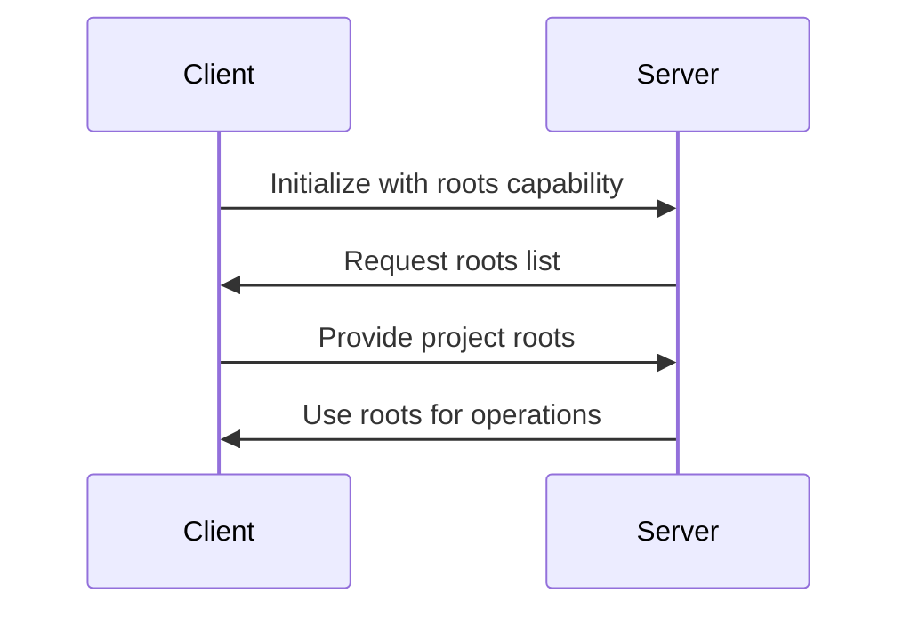

# Project Context Discovery with [MCP Roots](https://modelcontextprotocol.io/specification/2025-06-18/client/roots)

Roots are a way to grant MCP servers access to specific files and folders on your local machine. Think of them as a permission system that says "Hey, MCP server, you can access these files" - but they do much more than just grant permission.

### The Problem
Development tools often need to understand the project structure they're working with:
- Which files belong to the project?
- Where are source files located?
- What are the project boundaries?

Traditionally, this required manual configuration:
```python
project_dir = "/path/to/project"  # Hardcoded or configured
analyze_code(f"{project_dir}/src/main.py")
```

Without roots, you'd run into a common issue. Imagine you have an MCP server with a video conversion tool that takes a file path and converts an MP4 to MOV format.

When a user asks Claude to "convert biking.mp4 to mov format", Claude would call the tool with just the filename. But here's the problem - Claude has no way to search through your entire file system to find where that file actually lives.

Your file system might be complex with files scattered across different directories. The user knows the biking.mp4 file is in their Movies folder, but Claude doesn't have that context.

You could solve this by requiring users to always provide full paths, but that's not very user-friendly. Nobody wants to type out complete file paths every time.

## The Solution: MCP Roots
MCP Roots provides automatic project context discovery:
1. Clients (IDEs, editors) expose project directories
2. Servers (tools, analyzers) request access as needed
3. No manual configuration required

```python
# Server just requests roots and gets project context
roots = await ctx.session.list_roots()
project_files = roots.roots[0].list_files("**/*.py")
```

### Roots in Action
Here's how the workflow changes with roots:

1. User asks to convert a video file
2. Agent calls list_roots to see what directories it can access
3. Agent calls read_dir on accessible directories to find the file
4. Once found, Agent calls the conversion tool with the full path

This happens automatically - users can still just say "convert biking.mp4" without providing full paths.

## 🛠️ Implementation

### Client Side
The client needs to:
1. Implement the roots capability
2. Handle roots/list requests
3. Provide project directory information

See `client.py` for a basic implementation.

### Server Side
The server can:
1. Request project roots from client
2. Use roots to analyze project structure
3. Work with files in project context

See `server.py` for a basic implementation.

## 🔍 Key Concepts

### 1. Project Roots
- **Definition**: Directories that form the boundaries of a project
- **Examples**: 
  - Workspace folders in VS Code
  - Project directories in PyCharm
  - Git repository root directories

### 2. URI Representation
```python
# Example root structure
{
    "uri": "file:///home/user/projects/myapp",
    "name": "MyApp Project"
}
```

### 3. Client-Server Flow


## 💻 Hands-On Implementation

### Step 1: Setup Project
```bash
cd mcp_code
uv sync
```

### Step 2: Run the Demo
Terminal 1:
```bash
uv run uvicorn server:mcp_app --reload
```

Terminal 2:
   ```bash
   uv run python client.py
   ```

### Step 3: Observe the Output
You'll see:
1. Client initialization with roots capability
2. Server requesting project roots
3. Project analysis results showing:
   - File counts by type
   - Project features detection
   - Basic structure analysis


## 📚 Further Reading
- [MCP Roots Specification](https://modelcontextprotocol.io/specification/2025-06-18/client/roots)
- [Project Context in Development Tools](https://modelcontextprotocol.io/blog/project-context)
- [Best Practices for Root Handling](https://modelcontextprotocol.io/blog/root-handling)

---

Remember: The power of MCP roots lies in enabling tools to understand and work with project context automatically, making development more efficient and context-aware. 