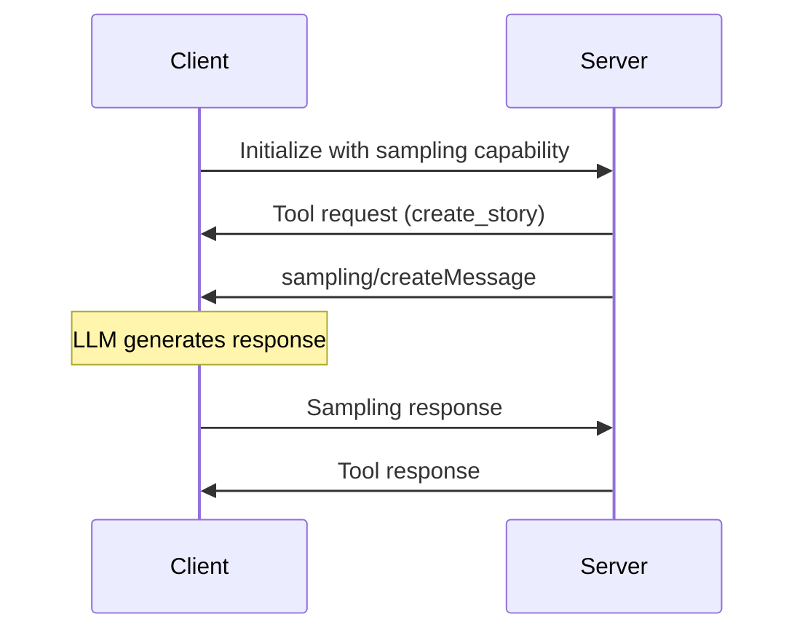

# 01: [Sampling](https://modelcontextprotocol.io/specification/2025-06-18/client/sampling) - Giving Tools a Brain

The Model Context Protocol (MCP) provides a standardized way for servers to request LLM sampling ("completions" or "generations") from language models via clients. This flow allows clients to maintain control over model access, selection, and permissions while enabling servers to leverage AI capabilities—with no server API keys necessary.

## 🎯 Learning Objectives
By the end of this lesson, you will be able to:
1. **Explain** why and when servers need to delegate reasoning to clients
2. **Implement** a sampling-enabled MCP server using stateful HTTP connections
3. **Build** a client that can handle sampling requests from servers
4. **Design** tools that leverage LLM reasoning capabilities
5. **Understand** the difference between stateful and stateless MCP architectures
6. **Master** the MCP sampling capability declaration and message flow
7. **Apply** proper error handling and security practices

## 🧠 Core Challenge: When Should Tools "Think"?

**Scenario:** You're building a content generation tool. You have two options:

**Option A: Hardcoded Logic**
```python
def create_story(topic: str) -> str:
    return f"Once upon a time, there was a {topic}. The end."
```

**Option B: AI-Powered Logic**
```python
async def create_story(ctx: Context, topic: str) -> str:
    # Ask the client's LLM to generate creative content
    prompt = f"Write a creative story about: {topic}"
    result = await ctx.sampling.create(messages=[...])
    return result.content
```

**🤔 Think:** Which approach would produce better, more varied, and more engaging stories?

### The Power of Delegation

**Sampling** represents a fundamental shift in tool design:

- **Traditional Tools:** Server contains all the logic and intelligence
- **Sampling-Enabled Tools:** Server defines the process, client provides the intelligence
- **Result:** Tools that can adapt, reason, and produce sophisticated outputs

### Key MCP Concepts Illustrated

- **`sampling/create` (Request):** Server-to-client request for LLM inference
- **Agentic Tools:** Tools that use AI reasoning as part of their workflow
- **Stateful Connections:** Required for server-to-client communication
- **Capability Negotiation:** Client declares sampling support during initialization

## 🔑 Key MCP Sampling Concepts

### Message Flow


### Capability Declaration
```python
# Client declares sampling support
capabilities = ClientCapabilities(
    sampling=SamplingCapability(
        models=["openai/gpt-4o-mini"]  # Supported models
    )
)
```

### Message Structure
```python
# Server sampling request
result = await ctx.session.create_message(
    messages=[
        SamplingMessage(
            role="user",
            content=TextContent(
                type="text", 
                text="Write a story about..."
            )
        )
    ],
    max_tokens=100
)
```

## 🏗️ Architecture Deep Dive

### Why Stateful HTTP?

**Traditional HTTP (Stateless):**
```
Client → Tool Request → Server
Client ← Tool Response ← Server
```

**Sampling HTTP (Stateful):**
```
Client → Tool Request → Server
Client ← Sampling Request ← Server  (Server asks client to think)
Client → Sampling Response → Server
Client ← Tool Response ← Server
```

**Key Point:** Sampling requires **bidirectional communication**. The server must be able to send requests back to the client, which requires maintaining connection state.

### Implementation Requirements

1. **Server Configuration:**
   ```python
   mcp = FastMCP(
       name="sampling-server",
       stateless_http=False  # CRITICAL
   )
   ```

2. **Client Capability Declaration:**
   ```python
   capabilities = ClientCapabilities(
       sampling=SamplingCapability()  # Declares "I can handle sampling requests"
   )
   ```

3. **Streamable HTTP App:**
   ```python
   mcp_app = mcp.streamable_http_app()  # Supports persistent connections
   ```

## 🏗️ Implementation Best Practices

### 1. Server-Side Considerations
- Always use `stateless_http=False` for sampling
- Implement proper error handling for sampling failures
- Consider rate limiting and timeout configurations
- Validate sampling responses before using them

### 2. Client-Side Requirements
- Implement proper sampling callback handling
- Support model selection and preferences
- Handle errors gracefully and provide meaningful feedback
- Consider user approval flows for sampling requests

### 3. Security Guidelines
```python
# Example: Client-side sampling with user approval
async def mock_sampler(context: RequestContext, params: CreateMessageRequestParams):
    # 1. Validate request
    if not is_valid_request(params):
        return ErrorData(code=-1, message="Invalid request")
        
    # 2. Get user approval (in production)
    # if not await get_user_approval(params):
    #     return ErrorData(code=-2, message="Request rejected by user")
    
    # 3. Generate response with proper error handling
    try:
        response = await generate_response(params)
        return CreateMessageResult(
            role="assistant",
            content=TextContent(text=response),
            model="openai/gpt-4o-mini"
        )
    except Exception as e:
        return ErrorData(code=-3, message=str(e))
```

## 📋 Hands-On Exercise: Build Your Own Sampling Tool

### Step 1: Analyze the Given Implementation

**🔍 Exploration Task:**
1. Open `mcp_code/server.py`
2. Find the `create_story` tool
3. Identify where `ctx.sampling.create()` is called
4. Trace how the prompt is constructed

**💭 Reflection Questions:**
- Why does the server construct the prompt instead of just passing the topic?
- What would happen if `stateless_http=True`?
- How does the server handle sampling failures?

### Step 2: Extend the Implementation

**🛠️ Coding Challenge:**
Add a new tool called `analyze_sentiment` that:
1. Takes a text input
2. Uses sampling to analyze the sentiment
3. Returns both sentiment and confidence level

**Starter Code:**
```python
@mcp.tool()
async def analyze_sentiment(ctx: Context, text: str) -> str:
    # TODO: Construct appropriate prompt for sentiment analysis
    # TODO: Use ctx.sampling.create() to get AI analysis
    # TODO: Parse and return structured results
    pass
```

### Step 3: Test Your Understanding

**🧪 Experiment:**
1. Run the client with different story topics
2. Observe how the AI generates different stories each time
3. Try modifying the prompt to change the story style

**📊 Questions to Explore:**
- How does prompt engineering affect output quality?
- What happens when the client's sampler fails?
- How could you add validation to the sampling results?

## 🚀 Running the Demo

### Prerequisites
```bash
cd 01_sampling/mcp_code
uv sync
```

### Execution Steps

1. **Start with the Client:**
   ```bash
   uv run python client.py
   ```

2. **Observe the Flow:**
   - Client declares sampling capability
   - Client calls `create_story` tool
   - Server receives request and uses sampling
   - Client's sampler function is invoked
   - Story flows back through the chain

3. **Expected Output:**
   ```
   🎯 MCP Sampling Client - 2025-06-18 Demo
   🔗 Connecting to sampling server...
   ✅ Connected! Server: mcp-sampling-server
   -> Client: Calling 'create_story' tool with topic: 'a function's adventure'
   <- Client: Received 'sampling/create' request from server.
   -> Client: Sending mock story back to the server.
   🎉 Final Story Received from Server:
   'In a world of shimmering code, a brave little function...'
   ```

## 🧪 Active Learning Experiments

### Experiment 1: Prompt Engineering
**Goal:** Understand how prompt design affects output quality

**Task:** Modify the prompt in `server.py` to generate:
- Haikus instead of stories
- Technical documentation
- Code examples

**Learning:** Observe how AI delegation enables flexible tool behavior

### Experiment 2: Error Handling
**Goal:** Understand robust sampling implementation

**Task:** 
1. Make the client's sampler return an error
2. Observe how the server handles it
3. Implement proper error recovery

### Experiment 3: Multiple Sampling Calls
**Goal:** Build complex workflows with multiple AI interactions

**Task:** Create a tool that:
1. Uses sampling to generate a story outline
2. Uses sampling again to write each chapter
3. Combines results into a complete narrative

## 🏆 Assessment Checklist

Mark each as you master the concept:

- [ ] **I can explain** when to use sampling vs. hardcoded logic
- [ ] **I understand** why stateful HTTP is required for sampling
- [ ] **I can implement** a basic sampling-enabled tool
- [ ] **I can handle** sampling errors gracefully
- [ ] **I can design** effective prompts for different use cases
- [ ] **I can trace** the full request/response flow in sampling
- [ ] **I can explain** the security implications of AI delegation

## 💡 Real-World Applications

### Content Creation Tools
- **Blog generators** that adapt writing style to audience
- **Code documentation** that explains complex algorithms
- **Marketing copy** that matches brand voice

### Analysis Tools  
- **Code review assistants** that provide contextual feedback
- **Data interpretation** tools that explain statistical results
- **Legal document analysis** with natural language summaries

### Interactive Assistants
- **Programming tutors** that adapt explanations to skill level
- **Debugging helpers** that suggest fixes based on error context
- **Architecture advisors** that recommend patterns for specific scenarios

## 🔄 Connection to Other Lessons

**Building Foundation:**
- **This Lesson:** Server delegates reasoning to client
- **Next (Elicitation):** Server requests user input during execution
- **Next (Roots):** Server discovers user's project context

**Combined Power:**
When used together, these capabilities enable AI assistants that can reason about code (sampling), ask clarifying questions (elicitation), and understand project context (roots).

---

**🎓 Ready for the Next Challenge?** Once you've mastered AI delegation through sampling, move on to [02_elicitation](../02_elicitation/) to learn how tools can become interactive and conversational.

## 📚 Advanced Topics

### Model Preferences
The MCP spec allows servers to express model preferences through:
- Cost priority (0-1)
- Speed priority (0-1)
- Intelligence priority (0-1)
- Model hints for specific capabilities

Example server implementation:
```python
@mcp.tool()
async def analyze_text(ctx: Context, text: str) -> str:
    result = await ctx.session.create_message(
        messages=[...],
        model_preferences={
            "hints": [{"name": "claude-3-sonnet"}],
            "costPriority": 0.3,
            "speedPriority": 0.8,
            "intelligencePriority": 0.5
        }
    )
    return result.content.text
```

### Content Types
MCP sampling supports multiple content types:
- Text (most common)
- Images (base64 encoded)
- Audio (base64 encoded)

Choose the appropriate type based on your use case. 