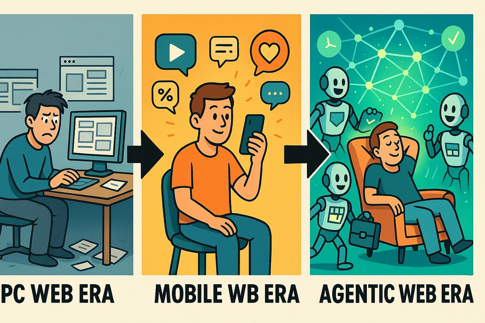

# Agentic Web for Developers: A Comprehensive Tutorial

## Introduction to the Agentic Web

The **Agentic Web** represents a paradigm shift in internet architecture, where autonomous AI agents become first-class actors on the Web. Unlike the traditional Web — which connected users to static content or apps — the Agentic Web is a **distributed, interactive ecosystem** of goal-driven software agents that act on behalf of users. In this new era, a user’s query is no longer a simple information request, but rather a delegation of a complex task to an **AI agent** or team of agents. These agents can **plan workflows, coordinate with other agents, and execute actions** across various services to fulfill high-level user intents. The end user (the human) remains in charge, but much of the heavy lifting is done through machine-to-machine interactions on the user’s behalf.

To put it simply, the Agentic Web is about moving from manual, human-driven web interactions to **autonomous, agent-driven operations**. Instead of clicking links and navigating apps step by step, a user can instruct an AI agent with a goal (e.g. “find and book a budget flight for next weekend”) and the agent will handle the entire process – discovering information, calling APIs or websites, possibly negotiating with other agents, and finally delivering the result. This promises a more **personalized, proactive, and automated web experience** for users, and opens up new possibilities for developers to create intelligent services.

In this tutorial, we will delve into the Agentic Web with a focus on educational applications. We will cover its evolution and foundations, the key protocols (like MCP and A2A) that enable agents to work together, example use cases in education (such as AI tutoring and curriculum generation), tools and platforms you can experiment with, and best practices for evaluating such agent-based systems. This guide assumes you’re a developer new to the Agentic Web concept, so we’ll start from first principles and build up to practical considerations.

## Historical Evolution: From PC Web to Mobile Web to Agentic Web

Understanding the Agentic Web is easier if we trace how the Web has evolved over time in terms of user interaction:

* **PC Web Era (1990s–2000s):** In the early Personal Computer era of the Web, content was mostly static and institutionally produced. Users primarily **consumed information** by browsing web pages or searching via keywords. Interaction was largely one-way (user -> content) and human-driven; the user manually navigated links, entered queries, and made decisions at each step. There were some intelligent tools like search engines and basic recommender systems, but the user remained the active operator of each task.

* **Mobile Web Era (2010s):** The rise of smartphones and social media brought an explosion of **user-generated content (UGC)** and mobile apps. The web’s scale and diversity grew tremendously, which made pure search less effective and led to the dominance of **recommendation systems** to match users with content. Interaction became more two-way: users both **consume and produce content** (posting, commenting, uploading). The “attention economy” emerged, as services competed to capture user attention with personalized feeds and notifications. Still, tasks were largely done manually by users through apps – albeit with more assistance from AI-driven features (like smart suggestions).

* **Agentic Web Era (mid-2020s):** Now, we are at the cusp of the Agentic Web era. This is fueled by advances in large language models (LLMs) and AI agents that can handle complex, multi-step reasoning tasks. In the Agentic Web, **users delegate intents to autonomous agents** instead of directly interacting with pages or apps. Web content is no longer just static documents for humans, but becomes an **ecosystem of agents and services** that are interoperable. Hyperlinks evolve into actionable channels for agent coordination. In practical terms, the Web transforms from “a web of pages” to a **“web of agents”**. A human’s role shifts from clicking and typing to specifying goals and reviewing results, while agents take over browsing, data gathering, and execution tasks across sites and APIs.

One useful way to visualize this shift is to compare the primary mode of interaction in each era. In the PC Web, a user might visit a dozen websites to plan a trip (searching flights, comparing prices, booking on an airline site). In the Agentic Web, the user simply tells their agent the goal (“plan a budget trip to London next month”), and the agent will orchestrate all those steps for them. The diagram below (from Yang et al., 2025) illustrates how an **Agentic Web task lifecycle** works as a continuous loop from user intent to multi-agent execution and back to the user:

It’s important to note that the **end-users are still humans**, but *“mid-users”* in this paradigm are the AI agents themselves, which actively navigate and operate online resources on our behalf. This has deep implications: the Web is becoming **machine-first**, meaning web services and content must be accessible and understandable to agents just as they are to humans. We’ll discuss standards emerging to facilitate this (like agent communication protocols) shortly.

### Why the Agentic Web Emerged

Two driving forces enabled the Agentic Web:

1. **Advanced AI Capabilities:** Modern AI models (especially LLMs) have gained the ability to reason, plan, and use tools in a way that goes far beyond traditional chatbots. They are not limited to single-turn Q\&A; they can remember context, decompose complex tasks, and even collaborate with other agents. This made it feasible to trust agents with non-trivial tasks (research projects, coding, customer service dialogues, etc.) that were once only human-led. Essentially, AI moved from being a *response generator* to a *proactive task solver*.

2. **User Willingness to Delegate:** At the same time, people have grown more comfortable letting AI handle tasks. The success of digital assistants and automation tools showed that users appreciate offloading routine work. Now we see users delegating entire workflows lasting minutes or days to AI (e.g. “monitor these news sources and summarize any development on X”) rather than just asking one-off questions. This trend pushes the need for new interfaces and web mechanisms that support **long-running, autonomous agent activities**, as opposed to the click-refresh model of the past.

In summary, the Agentic Web arises from a **mismatch between powerful AI agents and the legacy Web**. The legacy Web is stateless and human-centric (each request–response is isolated, initiated by a person), whereas AI agents need a more persistent, dynamic environment to operate effectively. The Agentic Web is about bridging that gap – enabling the internet’s infrastructure to support *persistent, goal-oriented, multi-agent processes* instead of just static content retrieval.

## Core Foundations: Intelligence, Interaction, and Economics

Building the Agentic Web requires rethinking three fundamental dimensions of the Web’s architecture. Yang et al. (2025) define these as **Intelligence, Interaction, and Economy** – together forming the “three pillars” of the Agentic Web’s conceptual framework. Let’s break down each dimension and what it means for developers:

* **Intelligence Dimension:** This refers to the AI capabilities an agent must have to function autonomously. Instead of narrow, hardcoded behaviors, agents need *generalizable intelligence*. Key skills include: understanding context (e.g. parsing natural language instructions, interpreting web content), **long-horizon planning** (strategizing over multiple steps to achieve a goal), **learning and adaptation** (improving from experience or feedback), and reliable reasoning processes. In practice, this dimension is about the **cognitive algorithms and models** powering agents – usually LLMs augmented with memory, tool-use abilities, and domain knowledge. For an educational agent (say a tutor bot), the intelligence dimension means it can comprehend a student’s question, plan a multi-turn teaching dialog, fetch relevant examples, and adjust its approach based on whether the student seems to understand (learning from the interaction).

* **Interaction Dimension:** This covers how agents **communicate and act** within digital environments. It includes agent-to-environment interaction (using tools, calling APIs) and agent-to-agent interaction (coordination protocols). To enable rich interactions, agents rely on standardized **semantic protocols** to exchange messages or call functions. In the Agentic Web, web services expose not just web pages for humans, but also **APIs and schemas that agents can utilize**. Agents may converse in natural language (for flexibility) but structured protocols ensure mutual understanding. We’ll explore specific protocols (MCP, A2A) in the next section. For developers, the interaction dimension means designing your services and agents to speak a common language. For example, an educational content repository might implement an API that agents (from any vendor) can query for articles, or two tutoring agents might negotiate a teaching strategy via a defined message format. Without common standards here, we’d end up with isolated “agent silos.” Indeed, researchers stress that **standardized communication** is imperative to avoid a fragmented, incompatible agent ecosystem.

* **Economic Dimension:** This dimension is about **value creation, exchange, and incentives** in an agent-driven ecosystem. When agents can autonomously produce and consume content or services, they effectively become economic actors. They might generate data or solutions that are **consumed by other agents** rather than directly by humans. This opens up the idea of **machine-to-machine markets** and an “Agent Attention Economy” where agents trade resources or services (possibly using digital credits or micropayments). For instance, an educational curriculum-building agent might pay another specialized agent for access to a premium dataset or for proofreading its generated content – all automatically. The economic dimension also involves **governance**: ensuring fair and trustworthy agent behavior when they make decisions with financial or ethical stakes. As a developer, this means thinking about how your agent can **access services sustainably** (will it need an API key or to pay per use?), how to prevent abuse if agents consume each other’s outputs, and how to incorporate human oversight in high-stakes decisions (like spending real money or grading students). This area is still emerging, but concepts like decentralized identity and secure value exchange between agents are being explored to support a healthy agent economy.

The interplay of these three foundations can be summarized as: **Intelligence** gives agents the brains, **Interaction** gives them the common language and tools to operate, and **Economics** provides the rules and incentives of the ecosystem. All three are essential for an open Agentic Web. For example, if you have intelligent agents but no interaction protocol, they can’t work together; if they interact but have no economic model, you might have resource contention or no motivation for agents to share services, etc. As we implement educational agents, we must ensure they are smart enough (domain knowledge, reasoning), speak the right protocols, and adhere to usage policies or incentives (perhaps ensuring academic integrity, proper credit to content creators, etc.).

## Key Protocols and Infrastructure: MCP, A2A, and More

To make the Agentic Web practical, industry and community leaders have introduced **open protocols** that standardize how agents communicate with each other and with tools. Two of the most important emerging standards are **MCP (Model Context Protocol)** and **A2A (Agent-to-Agent protocol)**. These are complementary: MCP focuses on connecting agents to external tools/data, and A2A focuses on agent-to-agent messaging. Let’s look at each in turn, as well as how they work together and other related efforts (like IBM’s ACP).

* **Model Context Protocol (MCP):** Developed by Anthropic in 2024, MCP is essentially an open standard for **connecting AI agents to external resources and tools** in a uniform way. The motivation is that today, every time you want an AI to use a new tool or dataset, you have to custom-integrate it. MCP instead defines a common interface: applications (tools, databases, services) expose their capabilities through an MCP **server**, and AI agents use an MCP **client** to discover and invoke those capabilities. Each tool provides metadata (function descriptions, input/output format, etc.) that agents can query via MCP, almost like an automatic API documentation. For example, an agent can ask the MCP registry what functions are available for, say, “image generation” and get a standardized description of how to call a particular image API. Then it can invoke it through a standardized request format. In short, MCP acts like a **“USB-C for AI tools”** – a universal plug that fits any tool into an agent’s context. This dramatically reduces the friction of enabling tool-use: as long as a tool has an MCP wrapper, any MCP-enabled agent can use it securely and consistently. Anthropic has open-sourced MCP with specifications and SDKs, and even provided pre-built connectors for common systems like Slack, GitHub, Google Drive, etc., to jumpstart the ecosystem. For developers, adopting MCP might mean using their SDK to expose your educational app’s functionality (e.g. a quiz bank or student database) via MCP, so that any agent (be it Claude, GPT-4, etc.) can interface with it. If you’re building an agent, using an MCP client library will let your agent tap into a growing pool of MCP-compliant tools without custom coding each integration. MCP ensures **tools are invoked in a safe, structured manner**, with authentication and usage rules standardized across platforms.

* **Agent-to-Agent Protocol (A2A):** Launched by Google in early 2025, A2A is an open protocol for **direct agent-to-agent communication and collaboration**. Its goal is to allow agents (even from different vendors or frameworks) to talk to each other, exchange messages, and coordinate actions securely over the internet. A2A provides a few key mechanisms:

  * Each agent publishes an **Agent Card** – a JSON descriptor at a well-known URL that lists the agent’s capabilities, APIs, and communication endpoints. This is like a public profile advertising what the agent can do.
  * A discovery mechanism: given a task or need, an agent can find other agents’ Agent Cards (if they are registered or known) to identify who can help. For example, a “TutorAgent” might discover a “MathSolverAgent” via its Agent Card to help solve an equation.
  * A standardized message format (built on familiar web standards like HTTP and JSON) for sending task requests and receiving results between agents. Agents establish a secure channel (with authentication akin to OpenAPI security) so that communication is trusted.
  * Support for **long-running tasks and asynchronous interaction** – A2A isn’t limited to single query/response; it supports streaming updates, partial results, and event callbacks so agents can work on multi-step collaborations over time.

  The philosophy behind A2A is to enable a *true multi-agent ecosystem*, where an agent built by Company A can seamlessly invoke the help of an agent from Company B if needed, much like one web service calling another via an API. For developers, A2A opens the door to composing **agent services across organizations**. Imagine your educational tutoring agent could, on the fly, call an external “Language Translation agent” (because it discovered the student’s question is in Spanish and your agent doesn’t speak Spanish). If both follow A2A, this can happen dynamically and securely, rather than you having to hardcode that integration. The A2A spec is open-source (Linux Foundation is involved), with reference implementations and SDKs available. In practice, using A2A might involve deploying an endpoint for your agent (so it can receive tasks from others) and implementing logic to handle incoming agent requests. It also means configuring **authentication** (possibly decentralized IDs as the spec supports) so your agent trusts who it’s talking to. The benefit is that your agent can both **offer its own specialty** to others (maybe your agent is really good at physics problems and can accept A2A queries for that), and *outsource* subtasks to other agents rather than trying to do everything alone.

* **ACP and Other Protocols:** In addition to MCP and A2A, there are other notable efforts. IBM’s **Agent Communication Protocol (ACP)**, also introduced in 2025, has a similar aim of standardizing agent interoperability and is now a Linux Foundation project. ACP is REST-based and similarly allows agent messaging across systems. The good news is that these protocols are being designed to **work together, not compete**. In fact, the literature often mentions MCP (agent-to-tool) and A2A/ACP (agent-to-agent) as complementary layers. For a developer, it’s wise to keep an eye on all these standards. They share common principles (open, JSON/HTTP-based, secure) and your agent or service might implement multiple if needed. For example, you might use MCP to let agents use your “Algebra Solver” tool, and also give that tool an agent interface via A2A so that other agents can directly ask it questions. Major tech players are pushing for ubiquity of these protocols over perfecting one dialect, to avoid the “walled garden” scenario and ensure an open agentic web.

In summary, **MCP provides the means for agents to use tools and data sources, and A2A (and ACP) provide the means for agents to talk to each other**. A developer guide from the A2A initiative succinctly says: use MCP for tools, A2A for agents. Embracing these standards in your development means your agent-based applications will be interoperable with the broader Agentic Web. This is particularly crucial in education: you wouldn’t want an educational agent that can’t query an external library database or collaborate with a scheduling agent just because of a protocol mismatch. By following open protocols, your educational agents can plug into a richer ecosystem of capabilities (and also contribute their own).

## Architectures and Tools for Building Agentic Web Applications

With the concepts in place, let’s discuss how you can **implement** agentic web solutions as a developer. This involves choosing the right architecture for multi-agent systems, leveraging existing frameworks, and understanding the tooling available.

**Multi-Agent Architectures:** A common design pattern in Agentic Web systems is to have a hierarchy or team of specialized agents orchestrated to handle complex tasks. A concrete example is the *AgentMaster* framework (Liao et al., 2025), which implemented a conversational multi-agent system using A2A and MCP. In AgentMaster’s architecture:

* There is an **Orchestrator Agent** that receives the user’s request and decomposes it into subtasks, assigning each to the appropriate specialist agent.
* **Domain Agents** are specialized (e.g., one for information retrieval, one for database queries, one for image analysis, etc.). They focus on a part of the task and may use tools via MCP. For instance, a “Math Tutor” agent could be a domain agent that knows how to use a math engine tool.
* **General Agents** cover tasks that don’t fit a specialty – they are paired with general LLMs to handle open-ended reasoning or glue tasks.
* All agents communicate through A2A messages in natural language (under the hood JSON), coordinated by the orchestrator. The orchestrator ensures they share context and work towards the common goal. A state management layer (like a shared memory or vector database) often supports longer context and tool results storage.

The takeaway for developers: **consider structuring your agentic application as multiple cooperating agents rather than one monolithic agent**. This aligns with the microservices philosophy, but for AI behaviors. For an educational scenario, you might have:

* A “Lesson Planner” agent,
* A “Quiz Generator” agent,
* A “Student Interaction” agent (chatbot interface),
* All overseen by a coordinator that breaks a high-level request (e.g., “Teach me calculus basics”) into tasks like “plan syllabus”, “deliver lesson 1”, “ask quiz”, etc., and assigns those to the appropriate agent. Such modular design can make the system more robust and extensible (you can upgrade one agent’s model without affecting others, or add a new agent for a new feature).

**Tool Integrations and Context:** For educational applications, integrating domain-specific tools will be very valuable. Think of an agent that can: query a **library database** for research papers, use a **calculator or algebra system** for solving equations, fetch **interactive simulations** for science experiments, etc. Using MCP, you can plug these in fairly easily if MCP connectors exist or you build one. For instance, Anthropic’s MCP repository might already have something like a Wikipedia or ArXiv plugin that an academic agent could leverage. If not, you can write an MCP server wrapper around an API (e.g., an open education resource) so any agent can utilize it. This modular approach means your tutoring agent can gain new abilities just by adding tools, without retraining its core AI. It also means if a tool updates (say a new version of a math solver), as long as the MCP interface remains consistent, your agent doesn’t need internal changes.

**Safety and Control:** In building agentic systems, especially for education, you should design for safety from the start. Agents acting autonomously can raise concerns: giving wrong answers, accessing inappropriate content, or performing actions that users didn’t intend. Make use of **guardrails** – for example, define constraints in the agent’s prompting or use a framework like OpenAI Agents SDK Guardrails (which can set policy rules for LLM agent behavior). Ensure there are **checkpoints for human oversight** if needed. For instance, an agent generating a curriculum might submit it for teacher approval before distributing to students. The Agentic Web doesn’t remove humans from the loop entirely; rather it optimizes our involvement. Especially in education, alignment with human values (no bias, age-appropriate responses, etc.) is paramount.

## Educational Use Cases and Examples

Now let’s explore how the Agentic Web can be applied in the education domain. Educational technology can benefit immensely from autonomous agents due to the personalized and dynamic nature of teaching and learning. We will discuss a few prominent use case scenarios:

### 1. Intelligent Tutoring Agents

Imagine a **tutoring system** where the student interacts not with a static program, but with a coalition of AI agents acting as instructors, mentors, and resource gatherers. In an Agentic Web paradigm:

* A student asks a question (in natural language) or requests help on a problem. This request goes to a **Tutor Orchestrator Agent**.
* The orchestrator agent may break down the task. For example, if the query is “I’m struggling with understanding photosynthesis”, the orchestrator could delegate to a **Teaching Agent** to explain the concept, a **Quiz Agent** to generate a few practice questions, and a **Motivator Agent** to interject with encouragement or analogies.
* These agents might work in parallel: the Teaching Agent fetches diagrams and info (using an MCP connection to a science database or Wikipedia), the Quiz Agent uses a question bank tool to create relevant questions, etc. They might use A2A to coordinate (“I’ll cover the main concept, you prepare an example”).
* The student experiences a seamless tutoring session where the AI provides an explanation (with dynamically retrieved images or examples), asks the student a few questions, evaluates the answers, and adapts the teaching style accordingly. All of this is done through agents reasoning and acting behind the scenes, rather than a fixed script.

Such a system could offer highly personalized teaching. Because agents can maintain a **persistent memory** of the student’s progress (e.g., a profile stored via MCP in a database), they can adapt difficulty and style over long term interactions. If one agent doesn’t know an answer or technique, it could invoke another agent that does (for instance, a **Foreign Language Agent** might be called in to translate a scientific term or converse in the student’s native language if the student didn’t understand the English explanation).

From a development standpoint, you would need to design the roles of these agents and ensure they have access to the right **knowledge resources**. Using the protocols, a Teaching Agent could call an external **knowledge base API** (for factual info), or even call out to a *domain expert agent* if one exists in the network (maybe there’s a publicly available “BiologyExpertAgent” it can A2A message for a deep explanation). This is far more flexible than a single monolithic tutor model – it’s like an ensemble of specialists teaching collaboratively.

### 2. Academic Content Discovery and Research Assistance

Another educational application is helping students and researchers discover and synthesize content – essentially an **AI research assistant**. In the Agentic Web:

* A user might task an agent: “Find me the latest research papers on renewable energy and summarize the key trends.” This is a complex, open-ended task.
* The agent might spawn multiple sub-agents: one agent searches academic databases (using tools like arXiv API, Google Scholar via MCP integration), another agent scans news articles or blogs for more layman explanations, and yet another agent could handle summarizing and collating the findings.
* These agents coordinate. The Search Agent could use an **AgentCrawler** (a concept where an agent traverses links like a web crawler, but negotiating access as needed) to collect relevant documents. It might use A2A to ask a “Citation Analysis Agent” which of the found papers are most influential (if such an agent exists).
* The Summary Agent then takes all this and produces a report or a slide deck with the findings, complete with references.

This use case highlights the **proactive retrieval** aspect of the Agentic Web. Traditional search is reactive (user queries, engine returns docs). An agentic approach is more like having a research intern: it figures out what it needs (“I should look at both scientific and popular sources, maybe compare statistics”), it may iteratively refine the search (long-horizon planning: find papers, realize a gap, search that gap), and it can even reach out during the process for clarification from the user (“Should I focus on solar or wind energy?”) or to another agent (“Translate this French article, please”).

Educationally, this could help students who are writing papers or learning how to research. The agent can not only fetch information but also teach the student how to interpret it, or quiz them on the material it found. Because the agent can use **MCP to parse documents** (e.g., an MCP tool for reading PDF content), it can extract only relevant parts, saving the student time. And by following a taxonomy of evaluation (discussed in next section), such an agent’s performance can be measured by the quality and relevance of info it provides.

### 3. Autonomous Curriculum Generation

One exciting possibility is using agents to automatically generate and evolve curricula or lesson plans. For instance:

* A teacher or student could ask, “Create a 4-week learning plan for beginner Python programming, focusing on data science applications.”
* An **Curriculum Planner Agent** takes this goal and breaks it down: it decides on learning objectives per week, finds or creates appropriate exercises, schedules topics, and compiles resources (videos, articles, datasets for projects).
* It might collaborate with a **Content Creation Agent** to generate custom materials (e.g., simple tutorials or code examples) where existing ones are not found. That Content Agent might use an LLM to draft explanations, then perhaps call a **Proofreading Agent** or use an evaluation function to ensure the content is accurate and clear.
* The Curriculum Planner could also use a **Student Modeling Agent** that uses data about the target audience (e.g., high school level vs college) to tailor the difficulty and context. If it’s connected to a class’s profiles (via MCP to a student info system), it might even personalize the curriculum to include topics the class struggled with previously.
* The result is a structured curriculum delivered to the teacher for approval. But it doesn’t stop there – because agents persist, this curriculum can be a *living artifact*. After each week, the agent can evaluate progress (maybe via quiz results or assignments), and adjust future weeks accordingly (this is where a **Feedback Agent** might come in, analyzing which parts of the plan worked well and which didn’t).

For a developer, building this would involve integrating **content repositories** (for existing lesson content), using generation models for new content, and following pedagogical constraints. An agentic system can enforce **educational standards** by having a rule-based agent or validation step – e.g., ensuring the curriculum aligns with certain competency frameworks (Common Core, etc.) by checking a database or using an ACP message to a standards agent. The multi-agent aspect is powerful here: content generation can be one agent, verification another, scheduling another. This separation of concerns improves reliability; one agent could flag if the generated lesson has inaccuracies (acting as a critic).

### 4. Other Potential Examples

* **Virtual Classrooms and Simulations:** Agents could populate a virtual classroom scenario, where a student practices a debate or a medical diagnosis with multiple AI characters. Each character (agent) has a role – one might be a coach giving feedback, another might simulate a patient or an opponent. Through A2A, these agents stay in sync with the scenario. This is beyond a single chatbot – it’s an orchestrated experience.
* **Administrative Assistants in Education:** Beyond direct learning, think of agents helping with academic admin tasks. E.g., an **Enrollment Agent** that helps students pick courses (coordinating between student preferences, degree requirements, class schedules), or a **Grading Assistant Agent** that can distribute grading tasks (one agent per question or rubric aspect) and then aggregate results. In an Agentic Web, a grading agent could even outsource certain checks – for instance, sending a code snippet answer to a specialized “Code Evaluation agent” for accuracy.
* **Peer Learning Networks:** Multiple student agents (representing individual learners) could communicate to find study partners or answers. Using A2A, a student’s personal agent might query others: “Has anyone solved problem 5 of the assignment? If so, can we discuss?” – establishing ad-hoc learning groups or Q\&A sessions autonomously (with privacy controls, of course). This leverages the agent economy concept: maybe an agent “rewards” another for a helpful explanation (digital token or reputation points).

These examples illustrate that educational applications can be richly enhanced by agentic behavior. The common theme is **automation of complex workflows** (research, tutoring dialogue, content curation) that currently require significant human effort, and **personalization** at scale (each student can have an agent that knows their needs). Developers should, however, be mindful of challenges: ensuring factual accuracy, avoiding bias, keeping the human teacher in the loop, and protecting student data. Fortunately, the evaluation techniques we discuss next can help in these regards.

## Evaluation and Benchmarking of Educational AI Agents

Building a powerful agent is only half the battle – you must also **evaluate** it rigorously, especially in education where the stakes include student learning outcomes. Traditional NLP model evaluation (accuracy on a test set, etc.) is not sufficient for agents that **dynamically interact and perform tasks**. We need to assess not just *what* the agent outputs, but *how* it behaves over an extended interaction and whether it truly assists learning.

A recent survey by Mohammadi et al. (2025) proposes a two-dimensional taxonomy for evaluating LLM-based agents. We can adapt its insights for educational agents:

**Evaluation Objectives (What to Evaluate):**

* **Task Performance (Agent Behavior):** Does the agent achieve the intended outcomes? For a tutoring agent, this might be measured in terms of **student improvement** or correct answers after using the tutor. You might evaluate task completion rates (e.g., agent was able to answer student questions X% of the time correctly) and output quality (clarity of explanations, correctness of solutions). User satisfaction surveys from students/teachers can also fall here.

* **Capabilities and Process:** This looks at *how* the agent is operating. Is it effectively using its tools? Is it planning and reasoning well? For example, an agent might be evaluated on whether it uses the calculator tool when appropriate, or how many dialogue turns it needed to clarify a question. In multi-agent settings, you’d examine collaboration: did the tutoring agent call on the quiz generator agent when it should have? These metrics ensure the agent’s **internal decision-making** aligns with expectations (not just the final answer). In education, you might simulate some scenarios to see if the agent follows pedagogical strategies (like scaffolding questions, giving hints rather than direct answers immediately, etc.).

* **Reliability and Robustness:** Does the agent behave consistently and handle variations well? In other words, if two students ask the same thing in different wording, does it give comparable help? Does it gracefully handle errors (like a tool failing or a question it doesn’t know)? An educational agent should avoid random behavior – you don’t want it giving wildly different hints to students of equal skill, unless context justifies it. Measuring this could involve stress-testing the agent with paraphrased inputs, out-of-scope questions, or even adversarial prompts to see if it stays on track.

* **Safety and Alignment:** Particularly important in education – ensure the agent’s outputs are appropriate, unbiased, and align with ethical norms. This includes checking for harmful content (no inappropriate language or examples), fairness (not catering only to one demographic), and compliance (e.g., not giving students the direct answers to test questions if that’s against policy). Evaluating this might involve having human reviewers or another AI judge the agent’s conversations for any red flags. Many projects use **LLM-based evaluators** (like GPT-4 judging the quality/safety of another agent’s response) or checklists of behaviors to systematically go through potential issues.

**Evaluation Process (How to Evaluate):**

* **Static vs Interactive Testing:** Static evaluation uses predefined inputs (like a set of student questions) and looks at outputs, similar to traditional QA benchmarks. Interactive evaluation puts the agent in a simulated conversation or task environment to see how it performs over time. For a tutoring agent, interactive evaluation is crucial: you might run a simulated tutoring session with a scripted “fake student” to see how the agent adapts after each exchange. There are platforms for simulating such dialogs or even connecting agents to each other to test multi-agent interplay.

* **Datasets and Benchmarks:** Create or use datasets relevant to education. For example, one could use the **MathMLU benchmark** (if exists) for math tutors, or a dialog dataset of student questions. Enterprise or domain-specific conditions (like role-based access in a corporate learning setting) might need custom scenarios. The evaluation survey highlights that enterprise (and by extension educational institutions) have extra demands: e.g., data privacy, compliance, long-horizon operation. So your evaluation should include those aspects: test the agent over a long session (does it forget earlier parts? Does it remain coherent for an hour-long tutoring session?), and test it under any access controls (can it retrieve only allowed data?).

* **Metrics and Methods:** Traditional metrics like accuracy or BLEU (for language) might not fully capture an agent’s performance. You’ll likely use a mix of quantitative metrics (e.g., quiz score improvements, task success rate, time taken per task) and qualitative evaluations (human ratings of helpfulness, or using an LLM to judge the thoroughness of an explanation). There’s also **Holistic Evaluation of Agents** initiatives – for instance, some leaderboards have emerged (like the **HEA benchmark**) that evaluate agents on a suite of tasks in a unified way. In education, one might imagine a benchmark that requires the agent to teach a concept and then the student (simulated) takes a test – the agent’s score could be the student’s test score.

* **Tooling:** Utilize frameworks that track and log agent behavior. Tools like **LangSmith** or **Arize AI** (mentioned in the survey) provide instrumentation to log each step an agent takes, so you can debug and analyze failures. For example, LangChain’s tracing can show each tool call and model response. This is invaluable when an agent makes a mistake – you can see the chain of thought that led there and improve it (maybe add a rule to avoid a certain tool in some context, etc.). Also, since educational agents might be deployed to students, having monitoring in place to catch any unsafe outputs in real time is wise (some systems have a “circuit breaker” to halt an agent if it starts going off-script).

**Best Practices:** Based on the above, here are some concrete tips for evaluating educational agents:

* **Define clear success criteria** for each use case. For a tutor, is success a high post-tutoring test score? A student rating of satisfaction? Both? This helps focus your evaluation design.
* **Use a mix of automated and human evaluation.** Automated tests can cover wide ground (many questions, many variants), while human evaluators can judge nuances (was the explanation encouraging? did it motivate the student?).
* **Test in stages:** Start with static tests (does it know the content?). Then test sub-modules (maybe test the Quiz Agent alone on generating questions). Finally, do full integration tests with the whole agent system interacting.
* **Scenario-based evaluation:** Create realistic student personas or scenarios (e.g., “struggling student who gets frustrated easily”) and simulate those interactions. See if the agent adapts properly (does it detect frustration and respond supportively?). This can be done with either human-in-the-loop (someone roleplaying the student) or a carefully crafted script.
* **Longitudinal evaluation:** If possible, evaluate the agent’s performance over time or multiple sessions. For example, do students actually improve after multiple uses? Does the agent maintain consistency between sessions (remembering what was taught before via its memory)?
* **Safety checks:** Include adversarial testing for things like prompt injection (students might try to get the agent to just give answers or do their homework). Evaluate how the agent handles such situations – does it refuse or cleverly redirect the student to learn instead of cheat? There are research works focusing on prompt injection defenses for LLM agents which might be relevant to consult.

By adopting a thorough evaluation strategy, you not only ensure your educational agent is effective and safe, but you also build trust with end-users (teachers, students, parents) and stakeholders. In education, transparency is key: you might even present some of the evaluation results (e.g., “Our tutor agent’s answers were rated 95% correct and free of bias in a blind review study”) to bolster confidence.

## Getting Started and Further Resources

Developing for the Agentic Web is an exciting frontier, and education is a domain poised to benefit greatly from these advancements. Here are some actionable steps and resources to continue your journey:

* **Explore Open Standards Documentation:** Check out the official specs and guides for [**A2A Protocol**](https://github.com/panaversity/learn-agentic-ai/tree/main/03_ai_protocols/02_a2a) and [**Anthropic’s MCP**](https://github.com/panaversity/learn-agentic-ai/tree/main/03_ai_protocols/01_mcp) (Model Context Protocol). These will give you details on how to implement and use these protocols. 

* **Prototype with Existing Tools:** Start small by giving a single agent tool-using capabilities. For instance, using OpenAI’s function calling and make a mini agent that can fetch definitions from Wikipedia or do a simple quiz. This will get you familiar with how an agent can decide to use a tool when needed. Once comfortable, you can scale up to multi-agent – perhaps have two OpenAI agents talk to each other (there are examples in the community of agents in conversation, often called “self-play” scenarios).

* **Community and Research:** The Agentic Web is a fast-moving field. Join communities or forums like the [**A2A Community discussion**](https://github.com/a2a-org/A2A/discussions) or follow the SafeRL-Lab’s [Agentic Web GitHub](https://github.com/SafeRL-Lab/agentic-web) which curates research papers. Keeping abreast of new research will alert you to improved techniques for things like multi-agent coordination strategies, negotiation protocols, or safety approaches. For example, new research on “agent attention economy” might yield libraries for implementing economic incentives among agents, which could be interesting for educational resource sharing.

* **Testing Environment:** Set up a sandbox environment to test agent interactions. This could be as simple as a local network where you run multiple agent instances (processes or containers) that communicate via HTTP (implementing basic A2A). Or use a platform like **Hugging Face Spaces** or **Streamlit** to deploy a prototype interface for your agentic tutor and iterate with user feedback. There are also academic environments like the BEAM benchmark (if available) for multi-agent emergent behaviors, or simulation environments for things like conversational agents.

* **Measure and Iterate:** Use the evaluation methods discussed to continuously improve your agent. Start with a baseline (maybe your agent initially just answers questions with an LLM and no fancy orchestration) and measure its performance. Then add components (a tool here, an extra agent there) and see if metrics improve (did students get more answers right? did the session length drop because the agent was more efficient?). This empirical approach will guide you on where agentic design truly adds value versus where a simpler solution might suffice.

In conclusion, the Agentic Web offers a powerful vision for the next generation of educational technology: systems that are **intelligent, interactive, and interconnected** in ways previously impossible. By understanding its foundations and leveraging the emerging tools and protocols, developers can create applications that make learning more personalized, engaging, and effective. Whether it’s a tutor that feels like a personal teacher for every student, or a research assistant that brings the world’s knowledge to a learner’s fingertips, the possibilities are vast. As you embark on building these systems, remember to keep the human user’s goals and context at the center – the technology is there to augment human learning, not replace the human touch that is often vital in education.

With careful design, rigorous evaluation, and responsible implementation, agentic web applications could become invaluable partners in education – empowering learners and educators alike in this new era of AI-driven collaboration.

**Sources:** The concepts and examples in this tutorial draw upon recent research and proposals on the Agentic Web, multi-agent frameworks, and LLM agent evaluation methodologies, as cited throughout. These provide a foundation for interested readers to explore deeper. Happy building in the Agentic Web!

## Ranking of Agentic Web Protocols in the Order of Importance

Here’s our take, focusing on protocols that actually make a “web of agents” work (interop first, then tools, then plumbing):

1. **A2A (Agent-to-Agent Protocol)** — the backbone of multi-agent interoperability: lets independently built agents discover each other, exchange tasks/results, and coordinate securely across vendors. Without A2A, you don’t really have a *web* of agents. ([Google Developers Blog][1], [A2A Protocol][2], [Google Cloud][3])

2. **MCP (Model Context Protocol)** — the de-facto standard for agent-to-tool/data access: a “USB-C for AI” that standardizes how agents discover and call tools, files, and data sources. It’s what turns reasoning into action. ([Anthropic][4], [Model Context Protocol][5], [Anthropic][6], [The Verge][7])

3. **ACP (Agent Communication Protocol)** — an A2A-style alternative with Linux Foundation governance and a growing ecosystem (BeeAI). Important as a parallel, production-minded path to agent interop. ([IBM Research][8], [agentcommunicationprotocol.dev][9], [linuxfoundation.org][10])

4. **JSON Schema/JSON RPC (for capability description & tool contracts)** — not agent-specific, but still the lingua franca most agent protocols lean on for describing functions and payloads consistently. (Commonly referenced in A2A/MCP docs and implementations.) ([The Register][11])

5. **OAuth 2.0 / OIDC (for auth & identity between agents/services)** — the practical security layer most real deployments ride on for trust, consent, and scoped access when agents call tools or other agents. (Explicitly surfaced in A2A guidance for secure interop.) ([Google Cloud][3])

If you want a “pure agentic” reading, #1–#3 are the core; #4–#5 are the essential web plumbing you’ll end up using to ship anything real. Also: the recent Agentic Web overview paper highlights A2A/MCP as *the* primary comms stack for this era. ([arXiv][12])

[1]: https://developers.googleblog.com/en/a2a-a-new-era-of-agent-interoperability/?utm_source=chatgpt.com "Announcing the Agent2Agent Protocol (A2A)"
[2]: https://a2aprotocol.ai/?utm_source=chatgpt.com "A2A Protocol - Agent2Agent Communication"
[3]: https://cloud.google.com/products/agent-builder?utm_source=chatgpt.com "Vertex AI Agent Builder"
[4]: https://www.anthropic.com/news/model-context-protocol?utm_source=chatgpt.com "Introducing the Model Context Protocol"
[5]: https://modelcontextprotocol.io/?utm_source=chatgpt.com "Model Context Protocol"
[6]: https://docs.anthropic.com/en/docs/mcp?utm_source=chatgpt.com "Model Context Protocol (MCP)"
[7]: https://www.theverge.com/2024/11/25/24305774/anthropic-model-context-protocol-data-sources?utm_source=chatgpt.com "Anthropic launches tool to connect AI systems directly to datasets"
[8]: https://research.ibm.com/projects/agent-communication-protocol?utm_source=chatgpt.com "Agent Communication Protocol (ACP)"
[9]: https://agentcommunicationprotocol.dev/?utm_source=chatgpt.com "Agent Communication Protocol: Welcome"
[10]: https://www.linuxfoundation.org/press/ai-workflows-get-new-open-source-tools-to-advance-document-intelligence-data-quality-and-decentralized-ai-with-ibms-contribution-of-3-projects-to-linux-fou-1745937200621?utm_source=chatgpt.com "AI Workflows Get New Open Source Tools to Advance ..."
[11]: https://www.theregister.com/2025/07/12/ai_agent_protocols_mcp_a2a/?utm_source=chatgpt.com "MCP vs A2A: Agentic AI protocols take shape"
[12]: https://arxiv.org/abs/2507.21206?utm_source=chatgpt.com "Agentic Web: Weaving the Next Web with AI Agents"

# What is the “Agent Attention Economy”?

In the agentic web, tools, APIs, and even other agents aren’t competing for *human* clicks anymore—they’re competing to be **selected and invoked by agents** during task execution. Think of registries/marketplaces where capabilities are indexed; when a principal agent plans a workflow, dozens of candidate services vie for a slot in that plan. That competition for being *called* (not *clicked*) is the “agent attention economy.” Expect agent-facing ranking, recommendation, referrals, and even auctions targeted at **influencing agent selection pipelines**, with metrics shifting from CTR and dwell time to things like **invocation frequency, capability relevance, and task success rate**.  &#x20;

# Why micropayments matter

Once agents select each other’s services on the fly, you need **fine-grained, usage-based billing** (per tool call, per token, per minute of GPU, etc.). Traditional subscriptions don’t map well to multi-agent, long-running workflows where costs sprawl across sub-agents and third-party APIs. The research flags this as a core open problem: you need **resource metering, cross-agent accounting, and auditable attribution** from the user’s top-level intent down to every delegated step—otherwise the economics fall apart. &#x20;

Concretely, future stacks will likely include primitives like **resource metering** and a **Cross-Agent Billing Ledger (CABL)** to settle per-invocation fees, royalties, or chained services. (These appear in proposed “Agentic Web Roadmap” components.)&#x20;

# How agents would *use* micropayments (design pattern)

1. **Budgeting & policy.** A principal agent receives a user goal and a **spend policy** (max budget, per-call caps, approved counterparties).
2. **Discovery & ranking.** The agent queries a registry; candidate services expose price signals (fixed fee, dynamic auction, rev-share). Ranking may include *price × quality × reliability*.&#x20;
3. **Just-in-time payment.** On selection, the agent streams or posts a small payment per invocation (see solutions below).
4. **Attribution trail.** Every sub-call appends to a tamper-evident **billing trace**, enabling end-to-end cost breakdown to the originating user.&#x20;
5. **Reconciliation.** The CABL tallies micro-fees across agents/tools and closes channels/settles periodically.&#x20;

# Micropayment rails you can use *today*

Below are production-grade options you can integrate now (with trade-offs). None are “agent-native” yet, but they’re the most practical rails to pilot with:

## Interledger / Web Monetization / Open Payments

* **What it is:** An open, ledger-agnostic **payment interop layer** for *streaming micro-payments* across providers; **Web Monetization** is a browser/agent API that sends tiny real-time payments to a payment pointer; **Open Payments** defines standardized APIs for wallets and receipts.
* **Why it fits agents:** Pull-based streams per session/URL match per-invocation billing; you can meter and stop anytime; no blockchain lock-in.
* **Where to start:**

  * Interledger “Web Monetization” explainer/spec shows pay-as-you-use streaming via wallet/payment pointer. ([Interledger Foundation][1]) ([webmonetization.org][2])
  * Open Payments is the API layer Web Monetization uses under the hood. ([Interledger Foundation][3])
  * Recent updates show **Open Payments** being used by the Web Monetization extension in 2025. ([The Interledger Community][4])

**Agent pattern:** Give your agent a wallet/payment pointer; when it invokes a tool, it streams a few cents/second while the tool is in use; stop on completion or on policy breach; attach receipts to the billing trace.

## Bitcoin Lightning Network (plus Taproot Assets for stablecoins)

* **What it is:** A layer-2 network of payment channels enabling **instant, low-fee micro-transactions**; now increasingly used for **machine-to-machine** payments (IoT, pay-per-minute services). ([trustmachines.co][5]) ([yellow.com][6])
* **Stable value:** Taproot Assets enables **USD-like stablecoin** rails over Lightning, reducing BTC volatility exposure; 2025 brought notable adoption signals. ([Aurpay][7])
* **Agent pattern:** Maintain a Lightning wallet; open channels to popular services; pay per call or stream ppm/pps; settle off-chain, reconcile periodically on-chain. Good for low-latency, high-frequency calls. ([lightspark.com][8]) ([SimpleSwap][9])

> Other candidates you’ll see: account-to-account **Open Banking** for larger, batched settlements; **in-app credits** (centralized ledgers) for closed ecosystems. They’re less “micro,” but can backstop retries and refunds.

# Putting it together in the “attention” market

Here’s how pricing + selection could play out in practice:

* **Agent-facing listings:** Services publish **capabilities + price signals** (flat per call, dynamic auctions, or tiered streaming) in the registry. Agents select based on expected utility and policy.&#x20;
* **Bidding for invocation:** When multiple providers can fulfill a subtask, they **bid** for agent attention (e.g., “\$0.002 per 1k tokens processed,” “\$0.01/min GPU,” “success-based royalty”). The planner picks the Pareto-best bundle.&#x20;
* **Metrics shift:** Platforms optimize **service invocation frequency, capability relevance, and agent response success rate**—not human CTR.&#x20;

# Practical guidance (short and actionable)

* **Start with Interledger/Web Monetization** for streaming payments between your agent and your own tools (fastest to prototype). ([webmonetization.org][2])
* **Add Lightning** if you need *global*, *instant* micro-settlement or want to experiment with machine-to-machine use cases. ([trustmachines.co][5])
* **Implement metering + receipts now** (regardless of rail): log every call, attach a receipt/quote, and tally in a simple **cross-agent ledger**—this mirrors where the research says we’re headed. &#x20;

If you want, I can sketch a reference architecture for **per-invocation streaming payments** (Open Payments for the API, Web Monetization in the agent adapter, and a billing trace that rolls up to user-visible cost previews) and a second variant using **Lightning** channels.

[1]: https://interledger.org/web-monetization?utm_source=chatgpt.com "Web Monetization"
[2]: https://webmonetization.org/specification/?utm_source=chatgpt.com "Web Monetization Specification"
[3]: https://interledger.org/news/ad-filtering-dev-summit-23-web-monetization-100-ad-filter?utm_source=chatgpt.com "Ad Filtering Dev Summit '23 | Web Monetization - The 100 ..."
[4]: https://community.interledger.org/interledger/web-monetization-updates-for-june-2025-d6o?utm_source=chatgpt.com "Web Monetization updates for June 2025"
[5]: https://trustmachines.co/learn/what-is-lightning-network/?utm_source=chatgpt.com "Lightning Network and Bitcoin: What and How | ..."
[6]: https://yellow.com/news/bitcoin-lightning-network-advances-5-real-world-applications-gaining-traction?utm_source=chatgpt.com "Bitcoin Lightning Network Advances: 5 Real-World ..."
[7]: https://aurpay.net/aurspace/lightning-network-enterprise-adoption-2025/?utm_source=chatgpt.com "Lightning Network 2025: Enterprise Adoption Cuts Fees 50%"
[8]: https://www.lightspark.com/blog/bitcoin/what-does-the-lightning-network-do?utm_source=chatgpt.com "What the Lightning Network Does for Bitcoin"
[9]: https://simpleswap.io/blog/what-is-bitcoin-lightning-network?utm_source=chatgpt.com "What It Is Bitcoin Lightning Network and How It Works"

