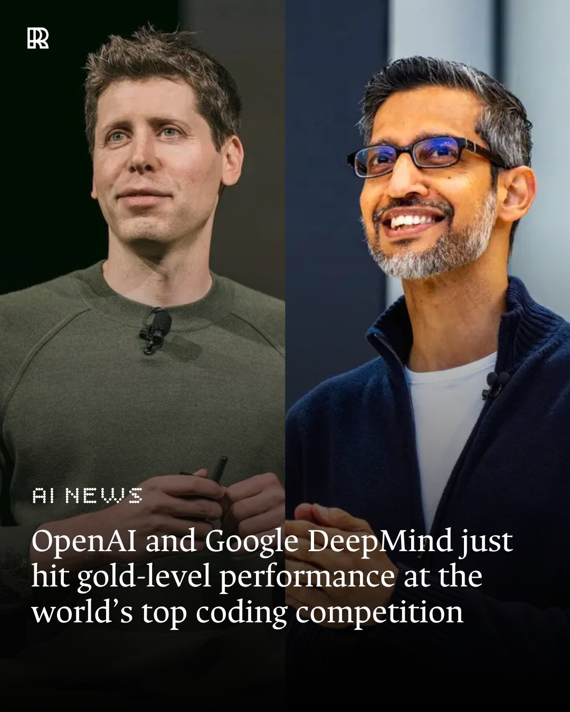

# The Summer 2025 Inflection Point in Software Development

**From Vibe Coding to Prompt-Driven, Test-Guarded Engineering (a.k.a. “creativity, but with a suit on”)**

## Abstract

The summer of 2025 marks a structural break in software practice driven by frontier LLMs (e.g., ChatGPT-5, Claude 4.1, Gemini Pro 2.5), AI-first IDEs (e.g., Cursor), and production-grade software development agents (e.g., Codex-class ChatGPT-5 Agents)—and yes, that sentence has more power words than a startup pitch deck on demo day. This paper argues that AI-assisted development is now the dominant mode of professional software creation, but that **how** we use AI determines whether we ship maintainable systems or compile chaos (think rocket vs. confetti cannon). We contrast **vibe coding** (exploratory, fast, and often brittle) with **Prompt-Driven Development (PDD)** integrated with **Test-Driven Development (TDD)**, **Architecture Decision Records (ADR)**, and **Pull Requests (PR)**—the “suit” that keeps creativity presentable (and the coffee off your shirt). We present an operating model, governance patterns, metrics, and a migration roadmap for teams adopting AI-first engineering at scale, with practical examples and prompts (because even experts appreciate good copy-paste magic).

---

## Why Summer 2025 Is Different

In 2025, LLMs crossed thresholds of reasoning, tool-use reliability, and latency that made human-AI pair programming not just viable but preferable (finally, your “pair” doesn’t hog the keyboard). AI-first IDEs integrated model context, code navigation, refactor tools, and repo-aware prompting; agents learned to read issues, implement changes, and open PRs with tests (and fewer cat pictures in commit messages). Yet results are bimodal: some teams report “many-fold” productivity gains, while others drown in rework from undisciplined prompting—proof that speed without method is just a faster route to bugs (like turbo mode on a lawnmower in your living room).

---

Here are recent, credible references that (taken together) make a strong case that **Summer 2025** is a real turning point for software development:

### 1) Adoption is now mainstream (not fringe)

* **Stack Overflow Developer Survey 2025 (July 2025):** **84%** of developers are using or plan to use AI tools; **51%** of professional developers use them **daily**. Sentiment is mixed but usage is decisively up versus 2024. ([Stack Overflow][1])

### 2) Capability milestones crossed in mid-2025

* **ICPC World Finals (Summer 2025):** OpenAI and Google DeepMind both showcased historic performances at the 2025 International Collegiate Programming Contest (ICPC) World Finals, the world’s premier coding competition.
OpenAI’s reasoning system, powered by GPT-5 and an experimental model, went flawless with a perfect 12/12 score in the AI track, a result that would have ranked first among all human teams.
DeepMind’s Gemini 2.5 “Deep Think” also impressed, solving 10 of 12 problems under the same conditions. That performance would have placed it second overall and was recognized as gold-medal level. 

### 3) Enterprises are reorganizing around agents/AI copilots

* **Workday’s agent strategy (late Summer 2025):** Major HCM/finance vendor launches a suite of AI agents, a dev platform for custom agents, and a \$1.1B AI acquisition—explicitly positioning AI agents as core to product value and ROI. Enterprise software leaders are treating agents as first-class product surfaces, not experiments. ([The Wall Street Journal][3])
* **Forbes Tech Council (Aug 2025):** Industry recap citing multi-hundred-developer deployments, acceptance rates, and satisfaction metrics for coding agents—evidence of **scaled**, **measured** use in production teams. ([Forbes][4])

### 4) Developer-productivity studies show real (if uneven) gains

* **Microsoft 3-week Copilot study (May 2025):** Regular use led developers to report **time savings** and higher perceived usefulness/joy; it also highlights the need for validation/guardrails—supporting the shift from “vibe coding” to **PDD + TDD** practices. ([GetDX Newsletter][5])
* **GitHub Copilot impact resources (ongoing, 2025):** Consolidates methods and findings to quantify productivity and quality improvements—useful for leaders instituting AI-first policies with measurable outcomes. ([GitHub Resources][6])

### 5) Ecosystem signals: AI-first IDEs & agents go “default”

* **Cursor/AI IDE ecosystem (June–July 2025):** Multiple industry write-ups and analyses point to rapid enterprise adoption, valuation inflection, and talent acquisitions—anecdata, yes, but consistent with the survey/result trends above. (Use for color; pair with the harder data sources.) ([Contrary Research][7])

---

#### Why these together = “turning point”

* **Mass adoption** (SO Survey) + **public capability proof** (ICPC win) + **enterprise productization** (Workday/agents) + **measured productivity studies** (Copilot) form a coherent picture: in **Summer 2025** AI coding shifted from optional enhancer to **default expectation**. The remaining gap (trust/validation) is exactly where structured practices (PDD + TDD + ADR + PR) close the loop. ([Stack Overflow][1])

- [The Times](https://www.thetimes.co.uk/article/deepmind-hails-kasparov-moment-as-ai-beats-best-human-coders-pbbbm8g96?utm_source=chatgpt.com)
- [The Times of India](https://timesofindia.indiatimes.com/technology/tech-news/google-ceo-sundar-pichai-celebrates-geminis-gold-win-at-world-coding-contest-such-a-profound-leap/articleshow/123971105.cms?utm_source=chatgpt.com)
- [The Wall Street Journal](https://www.wsj.com/articles/workdays-plan-to-win-the-ai-agent-race-a36ff544?utm_source=chatgpt.com)

[1]: https://survey.stackoverflow.co/2025/ai?utm_source=chatgpt.com "AI | 2025 Stack Overflow Developer Survey"
[2]: https://www.thetimes.co.uk/article/deepmind-hails-kasparov-moment-as-ai-beats-best-human-coders-pbbbm8g96?utm_source=chatgpt.com "DeepMind hails 'Kasparov moment' as AI beats best human coders"
[3]: https://www.wsj.com/articles/workdays-plan-to-win-the-ai-agent-race-a36ff544?utm_source=chatgpt.com "Workday's Plan to Win the AI Agent Race"
[4]: https://www.forbes.com/councils/forbestechcouncil/2025/08/12/ai-coding-agents-driving-the-next-evolution-in-software-development/?utm_source=chatgpt.com "AI Coding Agents: Driving The Next Evolution In Software ..."
[5]: https://newsletter.getdx.com/p/microsoft-3-week-study-on-copilot-impact?utm_source=chatgpt.com "Findings from Microsoft's 3-week study on Copilot use"
[6]: https://resources.github.com/learn/pathways/copilot/essentials/measuring-the-impact-of-github-copilot/?utm_source=chatgpt.com "Measuring Impact of GitHub Copilot"
[7]: https://research.contrary.com/company/anysphere?utm_source=chatgpt.com "Report: Anysphere Business Breakdown & Founding Story"
