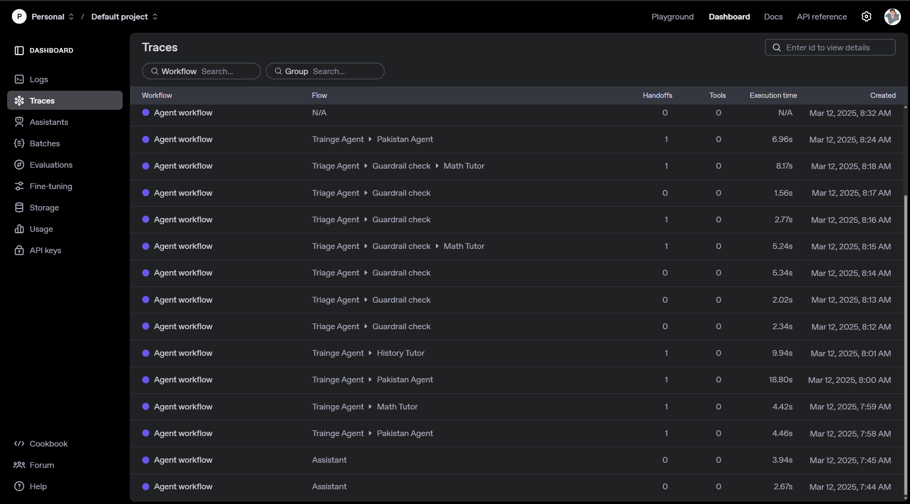

# OpenAI Agents SDK

This is a simple example of how to use the [OpenAI Agents SDK](https://openai.github.io/openai-agents-python/).

## Initialize the project using UV

```bash
uv init agents-sdk --package
```

## Install the dependencies

```bash
uv add openai-agents
```

### Activate the virtual environment (Windows)

```bash
.venv\Scripts\activate
```

### Activate the virtual environment (Linux/MacOS)

```bash
source .venv/bin/activate
```

## Create a `.env` file

```bash
OPENAI_API_KEY=your_openai_api_key
```

## Run the script

A simple agent

```bash
python src/agents_sdk/main.py
```

## Run the script with multi-agent

A simple multi-agent system workflow

```bash
python src/agents_sdk/multi-agent.py
```

## Run the script with guardrail

Advance guardrail agent with question validation

```bash
python src/agents_sdk/guardrail.py
```

## View your traces

To review what happened during your agent run, navigate to the [Trace viewer in the OpenAI Dashboard](https://platform.openai.com/traces) to view traces of your agent runs.



## Next steps

Learn how to build more complex agentic flows:

- Learn about how to configure [Agents](https://openai.github.io/openai-agents-python/agents/)
- Learn about [running agents](https://openai.github.io/openai-agents-python/running_agents/)
- Learn about [tools](https://openai.github.io/openai-agents-python/tools/), [guardrails](https://openai.github.io/openai-agents-python/guardrails/), and [models](https://openai.github.io/openai-agents-python/models/)
